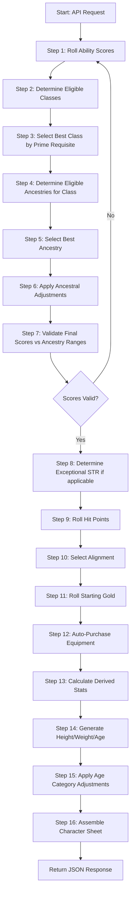

# OSRIC 3.0 Character Generator — Functional Specification

**Version**: 1.0.0
**Date**: 2025-07-12
**Status**: Draft

---

## 1. Executive Summary

A non-interactive REST API that generates complete OSRIC 3.0 player characters in a single request. Ability scores are rolled using Normal Mode (4d6 drop lowest, in order). Class is selected automatically by best prime requisite match. Ancestry, alignment, equipment, and all derived statistics are computed automatically following every step defined in the OSRIC 3.0 Player Guide (pages 11–83, 89). The API returns the character as structured JSON and also generates a fillable PDF character sheet matching the official OSRIC 3.0 Player Character Reference Sheet layout (pages 12–13 of the PDF).

---

## 2. Requirements

| ID | Requirement | Priority |
|----|-------------|----------|
| FR-001 | Generate 6 ability scores using Normal Mode (4d6 drop lowest, in order: STR, DEX, CON, INT, WIS, CHA) | Must |
| FR-002 | Automatically select the best class based on prime requisite scores | Must |
| FR-003 | Automatically select a compatible ancestry for the chosen class | Must |
| FR-004 | Apply ancestral ability score adjustments (+/- modifiers) | Must |
| FR-005 | Validate that final ability scores fall within ancestry min/max ranges | Must |
| FR-006 | Roll hit points using class hit die with CON modifier (minimum 1 HP) | Must |
| FR-007 | Select a valid alignment from class-permitted alignments | Must |
| FR-008 | Roll starting gold using class-specific formula | Must |
| FR-009 | Auto-purchase equipment within budget respecting class armor/weapon restrictions | Must |
| FR-010 | Calculate Armor Class (both descending and ascending) | Must |
| FR-011 | Calculate saving throws for level 1 | Must |
| FR-012 | Calculate to-hit table row or THAC0/BTHB for level 1 | Must |
| FR-013 | Calculate encumbrance and effective movement rate | Must |
| FR-014 | Determine thief/assassin/monk skills with DEX and ancestry adjustments | Must |
| FR-015 | Calculate all ability score-derived bonuses (STR to-hit/damage, DEX AC adj, CON HP mod, etc.) | Must |
| FR-016 | Determine height, weight, and starting age with age category adjustments | Must |
| FR-017 | Handle exceptional strength (18.xx) for fighters, paladins, and rangers with STR 18 | Must |
| FR-018 | Calculate bonus spell slots from WIS for clerics/druids | Must |
| FR-019 | Generate starting spellbook for magic-users (4 spells including Read Magic) and illusionists (3 spells) | Must |
| FR-020 | Determine weapon proficiency slots and auto-select proficient weapons | Must |
| FR-021 | Calculate XP bonus percentage from prime requisite scores | Must |
| FR-022 | Handle multi-class characters for non-human ancestries | Should |
| FR-023 | Determine turn undead capability for clerics | Must |
| FR-024 | Calculate CHA-derived values (sidekick limit, loyalty/reaction modifiers) | Must |
| FR-025 | Calculate INT-derived values (max additional languages) | Must |
| FR-026 | Return complete character as structured JSON matching the OSRIC character sheet layout | Must |
| FR-027 | Support optional seed parameter for deterministic/reproducible generation | Should |
| FR-028 | Expose API documentation via OpenAPI/Swagger | Must |
| FR-029 | Generate a filled PDF character sheet replicating the OSRIC 3.0 Player Character Reference Sheet (pages 12–13) | Must |
| FR-030 | PDF must be fillable — all form fields remain editable after generation so players can update values during play | Must |
| FR-031 | PDF is returned as a downloadable file via a dedicated endpoint, or inline as base64 in the JSON response | Must |
| FR-032 | PDF layout must include both pages: page 1 (header, abilities, saves, weapons & armour, to-hit table, equipment) and page 2 (wealth, special abilities, notes) | Must |
| FR-033 | PDF fields must be pre-filled with all generated character data and remain editable | Must |

---

## 3. Character Creation Workflow

The generator follows the exact order defined in OSRIC 3.0 Chapter 1:



---

## 4. Detailed Step Specifications

### 4.1 Step 1: Roll Ability Scores (Normal Mode)

For each of STR, DEX, CON, INT, WIS, CHA (in order):
1. Roll 4d6
2. Drop the lowest die
3. Sum the remaining 3 dice

Scores are fixed in order—no rearranging.

**Output**: Array of 6 integers, each in range [3, 18].

### 4.2 Step 2: Determine Eligible Classes

For each of the 10 classes, check whether the rolled scores meet minimum requirements:

| Class | STR | DEX | CON | INT | WIS | CHA |
|-------|-----|-----|-----|-----|-----|-----|
| Assassin | 12 | 12 | 6 | 11 | 6 | — |
| Cleric | 6 | — | 6 | 6 | 9 | 6 |
| Druid | 6 | — | 6 | 6 | 12 | 15 |
| Fighter | 9 | 6 | 7 | 3 | 6 | 6 |
| Illusionist | 6 | 16 | — | 15 | 6 | 6 |
| Magic-User | — | 6 | 6 | 9 | 6 | 6 |
| Monk | 10 | 15 | — | — | 10 | — |
| Paladin | 12 | 6 | 9 | 9 | 13 | 17 |
| Ranger | 13 | 6 | 14 | 13 | 14 | 6 |
| Thief | 6 | 9 | 6 | 6 | — | 6 |

A class qualifies if all its minimum scores are met. The dash (—) means no minimum for that ability.

### 4.3 Step 3: Select Best Class by Prime Requisite

**Algorithm**: Score each eligible class by its prime requisite value(s). Select the class with the highest prime requisite score. Ties are broken by class priority order (see below).

| Class | Prime Requisite | XP Bonus Threshold | Score Calculation |
|-------|----------------|-------------------|-------------------|
| Paladin | STR + WIS | Both ≥ 16 → 10% | min(STR, WIS) |
| Ranger | STR + INT + WIS | All ≥ 16 → 10% | min(STR, INT, WIS) |
| Druid | WIS + CHA | Both ≥ 16 → 10% | min(WIS, CHA) |
| Fighter | STR | ≥ 16 → 10% | STR |
| Cleric | WIS | ≥ 16 → 10% | WIS |
| Magic-User | INT | ≥ 16 → 10% | INT |
| Thief | DEX | ≥ 16 → 10% | DEX |
| Assassin | None | — | 0 (never preferred) |
| Illusionist | None | — | 0 (never preferred) |
| Monk | None | — | 0 (never preferred) |

**Scoring rules**:
1. Calculate prime requisite score for each eligible class using the "Score Calculation" column.
2. Classes with multi-attribute prime requisites use `min()` of their prime requisite values — this reflects that all attributes must be high for the XP bonus.
3. Rank by score descending.
4. On tie: prefer the class that appears first in the priority list above (Paladin > Ranger > Druid > Fighter > Cleric > Magic-User > Thief).
5. Classes with no prime requisite (Assassin, Illusionist, Monk) are only selected if no class with a prime requisite qualifies.
6. Among no-prime-requisite classes, prefer: Monk > Illusionist > Assassin (Monk has more unique capabilities; Illusionist is a full caster).

**Edge case**: If no classes qualify at all (all minimum scores fail), re-roll all ability scores from Step 1. The generator retries up to 100 times before returning an error.

### 4.4 Step 4: Determine Eligible Ancestries

Given the selected class, determine which ancestries can play that class:

| Ancestry | Available Classes |
|----------|------------------|
| Dwarf | Assassin, Cleric, Fighter, Thief, Fighter/Thief |
| Elf | Assassin, Cleric, Fighter, Magic-User, Thief, Fighter/MU, Fighter/Thief, MU/Thief, Fighter/MU/Thief |
| Gnome | Assassin, Cleric, Fighter, Illusionist, Thief, Fighter/Illusionist, Fighter/Thief, Illusionist/Thief |
| Half-Elf | Assassin, Cleric, Druid, Fighter, Magic-User, Ranger, Thief, and multi-class combos |
| Half-Orc | Assassin, Cleric, Fighter, Thief, and multi-class combos |
| Halfling | Fighter, Druid, Thief, Fighter/Thief |
| Human | All 10 single classes |

Filter: Only ancestries whose Available Classes list contains the selected class.

Then validate: After applying ancestral adjustments, the final scores must fall within the ancestry's ability score ranges:

| Ancestry | STR | DEX | CON | INT | WIS | CHA |
|----------|-----|-----|-----|-----|-----|-----|
| Dwarf | 8–18 | 3–17 | 12–19 | 3–18 | 3–18 | 3–16 |
| Elf | 3–18 | 7–19 | 6–18 | 8–18 | 3–18 | 8–18 |
| Gnome | 6–18 | 3–18 | 8–18 | 7–18 | 3–18 | 3–18 |
| Half-Elf | 3–18 | 6–18 | 6–18 | 4–18 | 3–18 | 3–18 |
| Half-Orc | 6–18 | 3–17 | 13–19 | 3–17 | 3–14 | 3–12 |
| Halfling | 6–17 | 8–18 | 10–19 | 6–18 | 3–17 | 3–18 |
| Human | 3–18 | 3–18 | 3–18 | 3–18 | 3–18 | 3–18 |

These ranges apply **after** ancestral adjustments are applied.

### 4.5 Step 5: Select Best Ancestry

**Algorithm**: Among eligible ancestries, select using this priority:
1. **Human** is always eligible (all classes, no adjustments, unlimited levels). Select Human unless a non-human ancestry provides a meaningful advantage.
2. Prefer a non-human ancestry only if:
   - The ancestry is eligible for the class
   - The adjusted scores still meet all class minimums and ancestry ranges
   - The ancestry provides thematic benefit (e.g., Halfling Thief gets +15% Hide, +15% Move Quietly)

**Simplified rule for non-interactive generation**: Always select Human unless the class is one where a specific ancestry is strongly advantageous:
- Thief: prefer Halfling (if scores qualify), then Elf, then Half-Elf, then Human
- Fighter: prefer Dwarf (if scores qualify, for CON bonus and stalwart saves), then Human
- Cleric: prefer Dwarf (stalwart saves), then Human
- Illusionist: prefer Gnome (only non-human option), then Human
- All other classes: Human (most classes are human-exclusive or humans have unlimited levels)

If no non-human ancestry qualifies (scores out of range after adjustments), default to Human.

### 4.6 Step 6: Apply Ancestral Adjustments

| Ancestry | Adjustments |
|----------|-------------|
| Dwarf | STR: —, DEX: —, CON: +1, INT: —, WIS: —, CHA: -1 |
| Elf | STR: —, DEX: +1, CON: -1, INT: —, WIS: —, CHA: — |
| Gnome | None |
| Half-Elf | None |
| Half-Orc | STR: +1, DEX: —, CON: +1, INT: —, WIS: —, CHA: -2 |
| Halfling | STR: -1, DEX: +1, CON: —, INT: —, WIS: —, CHA: — |
| Human | None |

Apply adjustments to the raw rolled scores. These may push scores above 18 or below 3 for certain ancestries (e.g., Dwarf CON can reach 19).

### 4.7 Step 7: Validate Final Scores

After adjustments, verify:
1. Each score falls within the ancestry's allowed range (Section 4.4 table)
2. Each score still meets the class minimums (Section 4.2 table)
3. If validation fails, the ancestry is rejected and the next candidate from Step 5 is tried. If all ancestries fail, re-roll from Step 1.

### 4.8 Step 8: Exceptional Strength

If the character is a Fighter, Paladin, or Ranger **and** final STR = 18:
1. Roll d100 for exceptional strength (range 01–00, where 00 = 100)
2. Record as "18.XX" (e.g., 18.52)
3. Use the exceptional strength row from the STR bonus table

| Range | To-Hit | Damage | Encumbrance |
|-------|--------|--------|-------------|
| 18.01–50 | +1 | +3 | 135 lbs |
| 18.51–75 | +2 | +3 | 160 lbs |
| 18.76–90 | +2 | +4 | 185 lbs |
| 18.91–99 | +2 | +5 | 235 lbs |
| 18.00 (100) | +3 | +6 | 300 lbs |

### 4.9 Step 9: Roll Hit Points

1. Roll the class hit die (d4, d6, d8, or d10)
2. Add CON HP modifier
3. Minimum result is 1 HP
4. Special: Rangers get 2d8 at level 1 (roll each, add CON mod to each, sum)
5. Special: Monks get 2d4 at level 1
6. Special: CON 17+ fighters/paladins/rangers get +3/+4/+5 instead of +2
7. Special: CON 19 — treat any die roll of 1 as 2

### 4.10 Step 10: Select Alignment

Choose randomly from the class's permitted alignments:

| Class | Permitted Alignments |
|-------|---------------------|
| Assassin | LE, NE, CE |
| Cleric | LG, NG, CG, LN, TN, CN, LE, NE, CE |
| Druid | TN only |
| Fighter | LG, NG, CG, LN, TN, CN, LE, NE, CE |
| Illusionist | LG, NG, CG, LN, TN, CN, LE, NE, CE |
| Magic-User | LG, NG, CG, LN, TN, CN, LE, NE, CE |
| Monk | LG, LN, LE |
| Paladin | LG only |
| Ranger | LG, NG, CG |
| Thief | LN, TN, CN, LE, NE, CE |

### 4.11 Step 11: Roll Starting Gold

| Class | Formula |
|-------|---------|
| Assassin | 2d6 × 10 gp |
| Cleric | 3d6 × 10 gp |
| Druid | 3d6 × 10 gp |
| Fighter | 5d4 × 10 gp |
| Illusionist | 2d4 × 10 gp |
| Magic-User | 2d4 × 10 gp |
| Monk | 5d4 gp (NOT ×10) |
| Paladin | 5d4 × 10 gp |
| Ranger | 5d4 × 10 gp |
| Thief | 2d6 × 10 gp |

### 4.12 Step 12: Auto-Purchase Equipment

**Strategy**: Purchase the best available equipment within budget, respecting class restrictions.

**Purchase priority order**:
1. **Armor** (most expensive, biggest AC impact): Buy best allowed armor the class can wear, within budget
2. **Shield** (if class allows): Buy small shield (cheapest, still -1 AC)
3. **Primary weapon**: Buy best allowed melee weapon
4. **Backup weapon**: Buy a secondary weapon if budget allows
5. **Holy symbol**: Required for Clerics/Druids/Paladins (pewter 5gp or silver 25gp)
6. **Thieves' Tools**: Required for Thieves/Assassins (30 gp)
7. **Spellbook**: Magic-Users and Illusionists already have one free
8. **Adventuring gear**: Backpack (2gp), waterskin (1gp), rations ×7 days (14gp), torches ×6 (6cp), rope 50ft (1gp), flint & steel (1gp)
9. **Ammunition**: If missile weapon purchased, buy 1 dozen
10. **Remaining gold**: Kept as coins (weight: 10 coins = 1 lb)

**Armor selection by class** (best to worst within restrictions):

| Class | Armor Priority |
|-------|---------------|
| Fighter, Paladin, Ranger | Chain mail (75gp) → Banded (90gp) → Scale (45gp) → Ring mail (30gp) → Studded leather (15gp) → Leather (5gp) |
| Cleric | Chain mail (75gp) → Banded (90gp) → Scale (45gp) → Ring mail (30gp) → Studded leather (15gp) → Leather (5gp) |
| Assassin | Studded leather (15gp) → Leather (5gp) |
| Thief | Studded leather (15gp) → Leather (5gp) → Padded (4gp) |
| Druid | Leather (5gp) only |
| Magic-User, Illusionist, Monk | None |

**Weapon selection by class** (primary weapon priority):

| Class | Primary Weapon Priority |
|-------|------------------------|
| Fighter, Paladin, Ranger | Long sword (15gp) → Broad sword (15gp) → Mace heavy (10gp) → Spear (1gp) |
| Cleric | Mace light (4gp) → Flail light (6gp) → Warhammer light (1gp) → Staff (free) → Club (2cp) |
| Druid | Scimitar (15gp) → Spear (1gp) → Club (2cp) → Staff (free) |
| Assassin | Long sword (15gp) → Short sword (8gp) → Dagger (2gp) |
| Thief | Short sword (8gp) → Dagger (2gp) → Club (2cp) |
| Magic-User | Dagger (2gp) → Staff (free) |
| Illusionist | Dagger (2gp) → Staff (free) |
| Monk | Staff (free) → Club (2cp) → Dagger (2gp) |

**Budget constraint**: Total equipment cost must not exceed rolled starting gold. The algorithm iterates through the priority list, purchasing the first affordable item in each category, skipping if budget is insufficient.

### 4.13 Step 13: Calculate Derived Statistics

#### 4.13.1 Armor Class

```
Base AC (descending) = 10
Armor AC = armor's AC value
Shield AC = -1 (if shield equipped)
DEX adjustment = from DEX table
Final AC (desc) = Armor AC + Shield AC + DEX adj
Final AC (asc) = 20 - Final AC (desc)
```

#### 4.13.2 Saving Throws (Level 1)

| Class | Aimed Magic Items | Breath Weapons | Death/Paralysis/Poison | Petrifaction/Polymorph | Spells |
|-------|------------------|----------------|----------------------|---------------------|--------|
| Assassin | 14 | 16 | 13 | 12 | 15 |
| Cleric | 14 | 16 | 10 | 13 | 15 |
| Druid | 14 | 16 | 10 | 13 | 15 |
| Fighter | 16 | 17 | 14 | 15 | 17 |
| Illusionist | 11 | 15 | 14 | 13 | 12 |
| Magic-User | 11 | 15 | 14 | 13 | 12 |
| Monk | 14 | 16 | 13 | 12 | 15 |
| Paladin | 14 | 15 | 12 | 13 | 15 |
| Ranger | 16 | 17 | 14 | 15 | 17 |
| Thief | 14 | 16 | 13 | 12 | 15 |

Applicable modifiers:
- WIS mental save modifier applies to "Spells" category
- Paladin: +2 to all saving throws (built into their table values)
- Dwarf/Gnome/Halfling: Stalwart bonus vs poison/spells/magic (CON-based)

#### 4.13.3 THAC0 / Base To-Hit

Level 1 THAC0 values:

| Class | THAC0 (To Hit AC 0) | Ascending BTHB |
|-------|---------------------|----------------|
| Assassin | 21 | -1 |
| Cleric | 20 | 0 |
| Druid | 20 | 0 |
| Fighter | 20 | 0 |
| Illusionist | 21 | -1 |
| Magic-User | 21 | -1 |
| Monk | 20 | 0 |
| Paladin | 20 | 0 |
| Ranger | 20 | 0 |
| Thief | 21 | -1 |

Note: Assassin/Illusionist/Magic-User/Thief need 21 to hit AC 0 at level 1 (their to-hit progression starts slower).

Melee to-hit modifier: STR to-hit bonus
Missile to-hit modifier: DEX missile to-hit bonus

#### 4.13.4 Encumbrance & Movement

1. Sum weight of all carried equipment (in lbs)
2. Look up STR encumbrance allowance from STR table
3. Calculate overage = total weight - allowance
4. Determine movement reduction:

| Overage (lbs) | Movement Multiplier | Surprise Modifier |
|---------------|--------------------|--------------------|
| 0 or less (unencumbered) | Full | +1 (light armor only) |
| 1–40 | × 3/4 | 0 |
| 41–80 | × 1/2 | 0 |
| 81–120 | × 1/4 | -1 |
| 121+ | Cannot move | -2 |

5. Base movement = ancestry base (120ft for Medium, 90ft for Small)
6. Armor movement cap applies (see armor table)
7. Final movement = min(base × encumbrance multiplier, armor cap)

#### 4.13.5 Thief/Assassin/Monk Skills

Base skills at level 1, modified by DEX and ancestry:

**Base Thief Skills (Level 1)**:

| Skill | Base |
|-------|------|
| Climb | 85% |
| Hide | 10% |
| Listen | 10% |
| Pick Locks | 25% |
| Pick Pockets | 30% |
| Read Languages | 1% |
| Move Quietly | 15% |
| Traps | 20% |

Apply DEX adjustments (from Table 1.3.10.4C) and ancestry adjustments (from Table 1.3.10.4D). Minimum 1% for any skill.

Monks use the same base skills but do NOT get Pick Pockets or Read Languages. Monks do NOT apply ancestry adjustments (monks are human-only).

#### 4.13.6 Turn Undead (Clerics Only)

At level 1, the cleric's turning values:

| Undead Type | Roll Needed |
|-------------|------------|
| Type 1 (Skeleton) | 10 |
| Type 2 (Zombie) | 13 |
| Type 3 (Ghoul) | 16 |
| Type 4 (Shadow) | 19 |
| Type 5 (Wight) | 20 |
| Type 6+ | — (cannot turn) |

#### 4.13.7 Bonus Spells (WIS-based, Clerics/Druids)

| WIS | Bonus Spell Slots |
|-----|-------------------|
| 13 | +1 first-level |
| 14 | +1 first-level (total +2) |
| 15 | +1 second-level |
| 16 | +1 second-level |
| 17 | +1 third-level |
| 18 | +1 fourth-level |

At level 1, only first-level bonus slots are usable. Higher-level bonus slots are recorded but cannot be used until the character can cast spells of that level.

#### 4.13.8 Starting Spells

**Magic-User**: Starts with a spellbook containing 4 first-level arcane spells. Read Magic is always included. The other 3 are selected randomly from:

Affect Normal Fires, Burning Hands, Charm Person, Comprehend Languages, Dancing Lights, Detect Magic, Enlarge, Erase, Feather Fall, Find Familiar, Friends, Hold Portal, Identify, Jump, Light, Niam's Magic Aura, Magic Missile, Mending, Message, Protection From Evil, Push, Shield, Shocking Grasp, Sleep, Spider Climb, Tanzur's Floating Disk, Unseen Servant, Ventriloquism, Write

(29 options for 3 slots — no duplicates)

**Illusionist**: Starts with a spellbook containing 3 first-level phantasmal spells, selected randomly from:

Audible Glamour, Change Self, Colour Spray, Dancing Lights, Darkness, Detect Illusion, Detect Invisibility, Gaze Reflection, Hypnotism, Light, Phantasmal Force, Wall of Fog

(12 options for 3 slots — no duplicates)

**Cleric**: Has access to all first-level divine spells. Memorizes 1 spell (+ WIS bonus slots). The generator selects Cure Light Wounds first, then fills remaining slots randomly from:

Bless, Command, Create Water, Detect Evil, Detect Magic, Light, Protection from Evil, Purify Food & Drink, Remove Fear, Resist Cold, Sanctuary

**Druid**: Has access to all first-level druidic spells. Memorizes 2 spells (+ WIS bonus slots). Selected randomly from:

Animal Friendship, Detect Magic, Detect Pits/Snares, Entangle, Faerie Fire, Invisibility to Animals, Locate Animals, Pass Without Trace, Predict Weather, Purify Water, Shillelagh

### 4.14 Step 14: Physical Characteristics

#### Height

| Ancestry | Formula |
|----------|---------|
| Dwarf | 48 + 3d4 inches |
| Elf | 54 + 3d4 inches |
| Gnome | 34 + 3d4 inches |
| Half-Elf | 60 + 4d4 inches |
| Half-Orc | 66 + 3d4 inches |
| Halfling | 34 + 3d4 inches |
| Human | 64 + 3d4 inches |

#### Weight

| Ancestry | Formula |
|----------|---------|
| Dwarf | 150 + 5d10 lbs |
| Elf | 70 + 5d10 lbs |
| Gnome | 45 + 4d10 lbs |
| Half-Elf | 90 + 5d10 lbs |
| Half-Orc | 150 + 5d10 lbs |
| Halfling | 45 + 4d10 lbs |
| Human | 140 + 6d10 lbs |

#### Starting Age

| Ancestry | Class Categories |
|----------|-----------------|
| Dwarf | Cleric: 250+2d20, Fighter: 40+5d4, Thief/Assassin: 75+3d6 |
| Elf | Cleric: 500+10d10, Fighter: 130+5d6, Magic-User: 150+5d6, Thief/Assassin: 100+5d6 |
| Gnome | Cleric: 300+3d12, Fighter: 60+5d4, Illusionist: 100+2d12, Thief/Assassin: 80+5d4 |
| Half-Elf | Cleric/Druid: 40+2d4, Fighter/Ranger: 22+3d4, Magic-User: 30+2d8, Thief/Assassin: 22+3d8 |
| Half-Orc | Cleric: 20+1d4, Fighter: 13+1d4, Thief/Assassin: 20+2d4 |
| Halfling | Fighter: 20+3d4, Druid: 40+3d4, Thief: 40+2d4 |
| Human | Cleric/Druid/Monk: 20+1d4, Fighter/Paladin/Ranger: 15+1d4, Magic-User/Illusionist: 24+2d8, Thief/Assassin: 20+1d4 |

### 4.15 Step 15: Age Category Adjustments

Determine age category from starting age and ancestry thresholds:

| Ancestry | Youth < | Adult | Grizzled | Elder | Ancient |
|----------|---------|-------|----------|-------|---------|
| Dwarf | 50 | 51+ | 150+ | 250+ | 350+ |
| Elf | 175 | 175+ | 550+ | 875+ | 1200+ |
| Gnome | 90 | 90+ | 300+ | 450+ | 600+ |
| Half-Elf | 40 | 40+ | 100+ | 175+ | 250+ |
| Half-Orc | 16 | 16+ | 30+ | 45+ | 60+ |
| Halfling | 33 | 33+ | 68+ | 101+ | 144+ |
| Human | 20 | 20+ | 40+ | 60+ | 90+ |

Apply age category modifiers to ability scores:

| Category | STR | DEX | CON | INT | WIS |
|----------|-----|-----|-----|-----|-----|
| Youth | — | — | +1 | — | -1 |
| Adult | +1 | — | — | — | +1 |
| Grizzled | -1 | — | -1 | +1 | +1 |
| Elder | -2 | -2 | -1 | — | +1 |
| Ancient | -1 | -1 | -1 | +1 | +1 |

Note: Age adjustments cannot push scores above 18 or below the ancestry minimum. If exceptional STR (18.xx) would be reduced by -1, it drops to plain 18.

### 4.16 Step 16: Assemble Character Sheet

All computed values are assembled into a structured response matching the OSRIC character sheet fields:
- Header: Name (auto-generated placeholder), Class, Level (1), Alignment, Ancestry, XP (0), HP, AC, Age, Height, Weight, Gender (random)
- Ability Scores: All 6 scores with all derived bonuses
- Saving Throws: 5 categories with modifiers applied
- Weapons & Armour: Equipped items with to-hit and damage values
- Equipment: Full inventory with weights
- Wealth: Remaining gold
- Special Abilities: Ancestry features and class features
- Spells: If applicable, memorized spell list

---

## 5. Edge Cases and Error Scenarios

| Scenario | Handling |
|----------|---------|
| No class qualifies for rolled scores | Re-roll from Step 1, up to 100 retries |
| No ancestry qualifies after class selected | Default to Human |
| Starting gold insufficient for any armor | Character goes unarmored |
| Starting gold insufficient for any weapon | Use Staff (free) or Club (2cp) |
| CON modifier makes HP ≤ 0 | HP is set to 1 (minimum) |
| Monk or Druid with very low gold | Minimal equipment only |
| Exceptional STR 18.00 (rolled 100) | Treated as 19 STR equivalent for bonuses |
| Multi-class XP split | Split equally, calculate HP as average of class dice |
| Age category is Youth | Apply -1 WIS, +1 CON; verify class mins still met |

---

## 6. Data Validation Rules

- All ability scores: integer, range 3–19 (19 only for Dwarf CON, Elf DEX, Half-Orc STR/CON, Halfling DEX/CON)
- Exceptional STR: only for Fighter/Paladin/Ranger with STR 18, range 01–00
- HP: integer ≥ 1
- AC: integer (descending), can be negative for high-DEX high-armor combos
- Gold: float ≥ 0 (remaining after purchases)
- All percentile skills: integer, range 1–99 (capped)
- All saving throws: integer, range 2–20
- Weight: in pounds, float
- Height: in inches, integer
- Age: integer ≥ 13 (Half-Orc Fighter minimum)

---

## 7. Integration Points

| Integration | Description |
|-------------|-------------|
| Random Number Generator | Python `random` module with optional seed for reproducibility |
| FastAPI REST Framework | POST endpoints returning JSON and PDF |
| Pydantic Validation | All input/output models validated |
| OpenAPI Documentation | Auto-generated from FastAPI |
| PDF Generation | fpdf2 library for creating fillable PDF character sheets |

---

## 8. PDF Character Sheet Specification

The API generates a fillable PDF that replicates the official OSRIC 3.0 Player Character Reference Sheet (pages 12–13 of the Player Guide). The PDF contains two pages with form fields pre-filled from the generated character data.

### 8.1 Page 1 Layout — Front Sheet

#### Header Section
| Field | Source | Editable |
|-------|--------|----------|
| Name | `character.name` | Yes |
| Class(es) | `character.character_class` | Yes |
| Alignment | `character.alignment` | Yes |
| Ancestry | `character.ancestry` | Yes |
| XP | `character.xp` (0) | Yes |
| HP | `character.hit_points` | Yes |
| AC | `character.armor_class_desc` [ascending] | Yes |
| Lvl | `character.level` (1) | Yes |
| Age | `character.physical.age` | Yes |
| Height | `character.physical.height_display` | Yes |
| Weight | `character.physical.weight_lbs` | Yes |
| Gender | `character.physical.gender` | Yes |

#### Abilities Section
| Row | Score Field | Derived Fields |
|-----|-------------|----------------|
| STR | `ability_scores.strength` | To Hit, Damage, Encumbrance, Minor Test, Major Test |
| DEX | `ability_scores.dexterity` | Surprise, Missile To Hit, AC, Agility Save Bonus, Missile Initiative Bonus |
| CON | `ability_scores.constitution` | HP Modifier, Resurrection Success, System Shock |
| INT | `ability_scores.intelligence` | Add Languages |
| WIS | `ability_scores.wisdom` | Mental Save |
| CHA | `ability_scores.charisma` | Max. Henchmen, Loyalty, Reaction |
| Movement Rate | `character.effective_movement` | — |

If exceptional strength applies (18.xx), the STR score field displays "18.XX" and the bonus columns use the exceptional strength row values.

#### Save Vs. Section
| Field | Source |
|-------|--------|
| Aimed Magic Items | `saving_throws.aimed_magic_items` |
| Breath Weapons | `saving_throws.breath_weapons` |
| Death, Paralysis, Poison | `saving_throws.death_paralysis_poison` |
| Petrification, Polymorph | `saving_throws.petrifaction_polymorph` |
| Spells | `saving_throws.spells` |

#### Weapons & Armour Section
Table with up to 5 rows. Each row maps to a `WeaponItem` from `character.weapons`:
| Column | Source |
|--------|--------|
| Weapons (name) | `weapon.name` |
| Damage vs. S-M | `weapon.damage_vs_sm` |
| Length | From weapon data table |
| Damage vs. L | `weapon.damage_vs_l` |
| Rate of Fire | From weapon data table (missile only) |
| Range (-2 to hit per) | From weapon data table (missile only) |
| Speed Factor | From weapon data table |
| Space Required | From weapon data table |
| Encumbrance | `weapon.weight` |

Armor row: includes equipped armor name and shield if any.

#### Roll Required to Hit Armour Class Section
Grid with AC values from 10[10] through -10[30]. Pre-filled from the character's to-hit table row, accounting for STR/DEX to-hit modifiers.

#### Armour/Protection Section
Three rows listing equipped armor, shield, and any other protection items with their AC contribution.

#### Equipment Section
Multiple lines listing all items from `character.equipment` with names.

### 8.2 Page 2 Layout — Back Sheet

#### Wealth Section
Table with 3 columns:
| Column | Source |
|--------|--------|
| Coin/Monetary | `character.gold_remaining` (formatted as GP, SP, CP) |
| Gems/Jewelry | Empty (editable) |
| Other | Empty (editable) |

#### Special Abilities (Ancestry) Section
Multiple lines pre-filled from `character.ancestry_features`. Each feature on its own line.

#### Special Abilities (Class) Section
Multiple lines pre-filled from `character.class_features`. Includes:
- Spellcasting details (if applicable)
- Turn undead (if cleric)
- Thief skills summary (if thief/assassin/monk)
- Backstab multiplier (if applicable)
- Other class abilities

#### Notes Section
Multiple blank editable lines. Pre-filled with:
- Weapon proficiencies list
- Languages known
- XP bonus percentage (if any)
- Spellbook contents (if applicable)
- Spells memorized (if applicable)

### 8.3 PDF Technical Requirements

- **Format**: PDF 1.7+ with AcroForm fields
- **Page size**: US Letter (8.5" × 11")
- **Font**: Helvetica (built-in PDF font, no embedding required)
- **Form fields**: All data fields are editable text fields (AcroForm)
- **Field naming**: Consistent snake_case names matching the JSON model (e.g., `str_score`, `str_to_hit`, `save_aimed_magic`)
- **Pre-filled values**: All generated character data is written into form field values
- **Read-only fields**: None — all fields remain editable for player use during gameplay
- **Visual fidelity**: Layout replicates the OSRIC character sheet structure with section headers, table borders, and grid lines

---

## 9. Assumptions

1. Character generation is level 1 only. No advancement or leveling logic.
2. Single-class characters only for v1.0. Multi-class support deferred to FR-022.
3. Dual-classing is not supported (it is a character advancement feature, not creation).
4. Name generation is out of scope — a placeholder "Unnamed Adventurer" is used.
5. Gender is randomly selected (Male/Female) with no mechanical effect.
6. No house rules or optional rules except ascending AC (which is included alongside descending).
7. Weapon specialization is excluded in v1.0 (it adds complexity and is optional).
8. The "Heroic Assault" fighter ability is a level 2 feature and is not included.
9. Equipment auto-purchase follows a deterministic priority algorithm, not random selection.
10. Coins carried contribute to encumbrance (10 coins = 1 lb).
11. The PDF character sheet layout is based on the official OSRIC 3.0 sheet (PDF pages 12–13). The scroll artwork on page 2 is not reproduced — the Notes section uses plain bordered box instead.
12. The PDF is generated server-side using fpdf2 — no external PDF template file is required.
