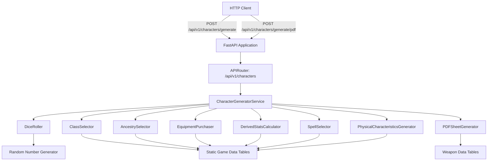
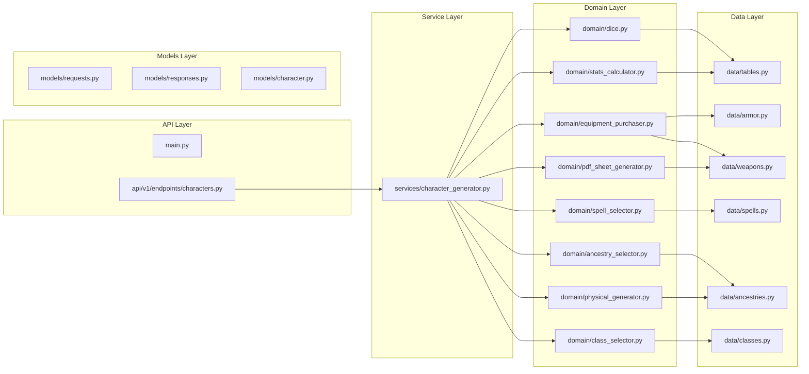
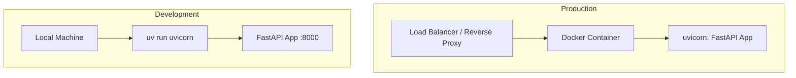
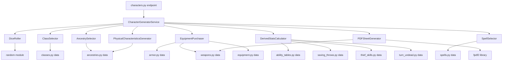

# OSRIC 3.0 Character Generator — Technical Specification

**Version**: 1.0.0
**Date**: 2025-07-12
**Status**: Draft

---

## 1. Executive Summary

Python 3.13 FastAPI application exposing REST endpoints that generate complete OSRIC 3.0 player characters as JSON and fillable PDF character sheets. The PDF replicates the official OSRIC 3.0 Player Character Reference Sheet (pages 12–13). Built with TDD, managed by uv, linted by Ruff, containerized with Docker. All game rules are encoded as static data tables with pure-function computation logic.

---

## 2. Architecture

### 2.1 System Architecture



### 2.2 Component Architecture



### 2.3 Deployment Architecture



---

## 3. Technology Stack

| Component | Technology | Version |
|-----------|-----------|---------|
| Language | Python | 3.13 |
| Web Framework | FastAPI | ≥ 0.115.0 |
| ASGI Server | uvicorn | ≥ 0.32.0 |
| Validation | Pydantic | ≥ 2.10.0 |
| Package Manager | uv | Latest |
| Linter/Formatter | Ruff | ≥ 0.8.0 |
| Testing | pytest | ≥ 8.3.0 |
| Test Client | httpx | ≥ 0.27.0 |
| Coverage | coverage.py / pytest-cov | ≥ 7.6.0 / ≥ 6.0.0 |
| Async Testing | pytest-asyncio | ≥ 0.24.0 |
| PDF Generation | fpdf2 | ≥ 2.8.0 |
| Containerization | Docker | Multi-stage build |

---

## 4. Project Structure

```
add_char_gen/
├── .github/
│   ├── workflows/
│   │   └── ci.yml
│   └── copilot-instructions.md
├── docs/
│   ├── specs/
│   │   ├── 01-functional-specification.md
│   │   └── 02-technical-specification.md
│   └── architecture/
│       └── diagrams.md
├── src/
│   └── osric_character_gen/
│       ├── __init__.py
│       ├── main.py
│       ├── api/
│       │   ├── __init__.py
│       │   └── v1/
│       │       ├── __init__.py
│       │       └── endpoints/
│       │           ├── __init__.py
│       │           └── characters.py
│       ├── core/
│       │   ├── __init__.py
│       │   └── config.py
│       ├── data/
│       │   ├── __init__.py
│       │   ├── ability_tables.py
│       │   ├── ancestries.py
│       │   ├── armor.py
│       │   ├── classes.py
│       │   ├── equipment.py
│       │   ├── saving_throws.py
│       │   ├── spells.py
│       │   ├── thief_skills.py
│       │   ├── turn_undead.py
│       │   └── weapons.py
│       ├── domain/
│       │   ├── __init__.py
│       │   ├── dice.py
│       │   ├── class_selector.py
│       │   ├── ancestry_selector.py
│       │   ├── equipment_purchaser.py
│       │   ├── stats_calculator.py
│       │   ├── spell_selector.py
│       │   ├── physical_generator.py
│       │   └── pdf_sheet_generator.py
│       ├── models/
│       │   ├── __init__.py
│       │   ├── character.py
│       │   ├── requests.py
│       │   └── responses.py
│       └── services/
│           ├── __init__.py
│           └── character_generator.py
├── tests/
│   ├── __init__.py
│   ├── conftest.py
│   ├── test_api/
│   │   ├── __init__.py
│   │   └── test_characters_endpoint.py
│   ├── test_domain/
│   │   ├── __init__.py
│   │   ├── test_dice.py
│   │   ├── test_class_selector.py
│   │   ├── test_ancestry_selector.py
│   │   ├── test_equipment_purchaser.py
│   │   ├── test_stats_calculator.py
│   │   ├── test_spell_selector.py
│   │   ├── test_physical_generator.py
│   │   └── test_pdf_sheet_generator.py
│   ├── test_services/
│   │   ├── __init__.py
│   │   └── test_character_generator.py
│   └── test_data/
│       ├── __init__.py
│       └── test_tables_integrity.py
├── .dockerignore
├── .gitignore
├── Dockerfile
├── docker-compose.yml
├── pyproject.toml
├── uv.lock
└── README.md
```

---

## 5. Data Models (Pydantic)

### 5.1 Core Domain Models

```python
from enum import StrEnum
from pydantic import BaseModel, Field


class Alignment(StrEnum):
    LG = "Lawful Good"
    NG = "Neutral Good"
    CG = "Chaotic Good"
    LN = "Lawful Neutral"
    TN = "True Neutral"
    CN = "Chaotic Neutral"
    LE = "Lawful Evil"
    NE = "Neutral Evil"
    CE = "Chaotic Evil"


class AncestryName(StrEnum):
    DWARF = "Dwarf"
    ELF = "Elf"
    GNOME = "Gnome"
    HALF_ELF = "Half-Elf"
    HALF_ORC = "Half-Orc"
    HALFLING = "Halfling"
    HUMAN = "Human"


class ClassName(StrEnum):
    ASSASSIN = "Assassin"
    CLERIC = "Cleric"
    DRUID = "Druid"
    FIGHTER = "Fighter"
    ILLUSIONIST = "Illusionist"
    MAGIC_USER = "Magic-User"
    MONK = "Monk"
    PALADIN = "Paladin"
    RANGER = "Ranger"
    THIEF = "Thief"


class Gender(StrEnum):
    MALE = "Male"
    FEMALE = "Female"


class AbilityScores(BaseModel):
    strength: int = Field(ge=3, le=19)
    dexterity: int = Field(ge=3, le=19)
    constitution: int = Field(ge=3, le=19)
    intelligence: int = Field(ge=3, le=19)
    wisdom: int = Field(ge=3, le=19)
    charisma: int = Field(ge=3, le=19)
    exceptional_strength: int | None = Field(
        default=None, ge=1, le=100,
        description="Only for Fighter/Paladin/Ranger with STR 18"
    )


class AbilityBonuses(BaseModel):
    str_to_hit: int = 0
    str_damage: int = 0
    str_encumbrance: int = 0
    dex_surprise: int = 0
    dex_missile_to_hit: int = 0
    dex_ac_adj: int = 0
    dex_initiative: int = 0
    con_hp_mod: int = 0
    con_resurrection: int = 0
    con_system_shock: int = 0
    int_max_languages: int = 0
    wis_mental_save: int = 0
    wis_bonus_spells: list[dict[str, int]] = Field(default_factory=list)
    cha_sidekick_limit: int = 4
    cha_loyalty_mod: int = 0
    cha_reaction_mod: int = 0


class SavingThrows(BaseModel):
    aimed_magic_items: int
    breath_weapons: int
    death_paralysis_poison: int
    petrifaction_polymorph: int
    spells: int


class EquipmentItem(BaseModel):
    name: str
    weight: float
    cost_gp: float
    equipped: bool = False
    notes: str = ""


class WeaponItem(BaseModel):
    name: str
    damage_vs_sm: str  # e.g. "1d8"
    damage_vs_l: str   # e.g. "1d12"
    weight: float
    cost_gp: float
    hands: int = 1
    to_hit_modifier: int = 0
    damage_modifier: int = 0
    is_proficient: bool = True
    weapon_type: str = "melee"  # "melee" or "missile"


class ArmorItem(BaseModel):
    name: str
    ac_desc: int
    ac_asc: int
    weight: float
    cost_gp: float
    movement_cap: int


class ThiefSkills(BaseModel):
    climb: int = Field(ge=1, le=99)
    hide: int = Field(ge=1, le=99)
    listen: int = Field(ge=1, le=99)
    pick_locks: int = Field(ge=1, le=99)
    pick_pockets: int = Field(ge=1, le=99)
    read_languages: int = Field(ge=1, le=99)
    move_quietly: int = Field(ge=1, le=99)
    traps: int = Field(ge=1, le=99)


class TurnUndeadEntry(BaseModel):
    undead_type: str
    example: str
    roll_needed: int | str  # int or "T" or "D" or "—"


class SpellSlots(BaseModel):
    level_1: int = 0
    level_2: int = 0
    level_3: int = 0
    level_4: int = 0
    level_5: int = 0
    level_6: int = 0
    level_7: int = 0


class PhysicalCharacteristics(BaseModel):
    height_inches: int
    height_display: str  # e.g. "5'8\""
    weight_lbs: int
    age: int
    age_category: str  # "Youth", "Adult", "Grizzled", etc.
    gender: Gender
```

### 5.2 Character Sheet Model (Response)

```python
class CharacterSheet(BaseModel):
    # Header
    name: str = "Unnamed Adventurer"
    character_class: ClassName
    level: int = 1
    alignment: Alignment
    ancestry: AncestryName
    xp: int = 0
    xp_bonus_pct: int = 0  # 0 or 10

    # Vitals
    hit_points: int = Field(ge=1)
    armor_class_desc: int
    armor_class_asc: int

    # Physical
    physical: PhysicalCharacteristics

    # Ability Scores & Bonuses
    ability_scores: AbilityScores
    ability_bonuses: AbilityBonuses

    # Combat
    thac0: int
    bthb: int  # Base To Hit Bonus (ascending)
    saving_throws: SavingThrows
    melee_to_hit_mod: int
    missile_to_hit_mod: int

    # Equipment
    armor: ArmorItem | None = None
    shield: EquipmentItem | None = None
    weapons: list[WeaponItem] = Field(default_factory=list)
    equipment: list[EquipmentItem] = Field(default_factory=list)
    gold_remaining: float

    # Encumbrance & Movement
    total_weight_lbs: float
    encumbrance_allowance: int
    encumbrance_status: str  # "Unencumbered", "Light", "Moderate", "Heavy", "Immobile"
    base_movement: int
    effective_movement: int

    # Class-specific
    thief_skills: ThiefSkills | None = None
    turn_undead: list[TurnUndeadEntry] | None = None
    spell_slots: SpellSlots | None = None
    spells_memorized: list[str] | None = None
    spellbook: list[str] | None = None

    # Features
    ancestry_features: list[str] = Field(default_factory=list)
    class_features: list[str] = Field(default_factory=list)
    weapon_proficiencies: list[str] = Field(default_factory=list)
    languages: list[str] = Field(default_factory=list)

    # Metadata
    generation_seed: int | None = None
    dice_rolls: dict | None = None  # Optional: raw dice rolls for auditing
```

### 5.3 Request Model

```python
class GenerateCharacterRequest(BaseModel):
    seed: int | None = Field(
        default=None,
        description="Optional seed for deterministic generation. "
                    "If omitted, a random seed is used."
    )
```

### 5.4 Response Wrapper

```python
class GenerateCharacterResponse(BaseModel):
    character: CharacterSheet
    generation_metadata: dict = Field(
        default_factory=dict,
        description="Metadata about the generation process "
                    "(retries, ancestry candidates, class scores)"
    )
```

---

## 6. API Contract

### 6.1 Endpoint

```
POST /api/v1/characters/generate
POST /api/v1/characters/generate/pdf
```

### 6.2 Request

**Content-Type**: `application/json`

**Body** (optional):
```json
{
    "seed": 42
}
```

If no body is sent, or `seed` is null, a random seed is generated.

### 6.3 Success Response

**Status**: `200 OK`
**Content-Type**: `application/json`

```json
{
    "character": {
        "name": "Unnamed Adventurer",
        "character_class": "Cleric",
        "level": 1,
        "alignment": "Neutral Good",
        "ancestry": "Human",
        "xp": 0,
        "xp_bonus_pct": 10,
        "hit_points": 6,
        "armor_class_desc": 5,
        "armor_class_asc": 15,
        "physical": {
            "height_inches": 72,
            "height_display": "6'0\"",
            "weight_lbs": 175,
            "age": 22,
            "age_category": "Adult",
            "gender": "Male"
        },
        "ability_scores": {
            "strength": 10,
            "dexterity": 12,
            "constitution": 14,
            "intelligence": 11,
            "wisdom": 16,
            "charisma": 13,
            "exceptional_strength": null
        },
        "ability_bonuses": {
            "str_to_hit": 0,
            "str_damage": 0,
            "str_encumbrance": 35,
            "dex_surprise": 0,
            "dex_missile_to_hit": 0,
            "dex_ac_adj": 0,
            "dex_initiative": 0,
            "con_hp_mod": 0,
            "con_resurrection": 92,
            "con_system_shock": 88,
            "int_max_languages": 2,
            "wis_mental_save": 2,
            "wis_bonus_spells": [
                {"level": 1, "slots": 2},
                {"level": 2, "slots": 2}
            ],
            "cha_sidekick_limit": 5,
            "cha_loyalty_mod": 0,
            "cha_reaction_mod": 5
        },
        "thac0": 20,
        "bthb": 0,
        "saving_throws": {
            "aimed_magic_items": 14,
            "breath_weapons": 16,
            "death_paralysis_poison": 10,
            "petrifaction_polymorph": 13,
            "spells": 13
        },
        "melee_to_hit_mod": 0,
        "missile_to_hit_mod": 0,
        "armor": {
            "name": "Chain Mail",
            "ac_desc": 5,
            "ac_asc": 15,
            "weight": 30.0,
            "cost_gp": 75.0,
            "movement_cap": 90
        },
        "shield": {
            "name": "Small Shield",
            "weight": 5.0,
            "cost_gp": 10.0,
            "equipped": true,
            "notes": "Blocks 1 attack per round"
        },
        "weapons": [
            {
                "name": "Mace, light",
                "damage_vs_sm": "1d4+1",
                "damage_vs_l": "1d4+1",
                "weight": 5.0,
                "cost_gp": 4.0,
                "hands": 1,
                "to_hit_modifier": 0,
                "damage_modifier": 0,
                "is_proficient": true,
                "weapon_type": "melee"
            }
        ],
        "equipment": [
            {"name": "Backpack", "weight": 0.0, "cost_gp": 2.0, "equipped": true, "notes": ""},
            {"name": "Waterskin", "weight": 3.0, "cost_gp": 1.0, "equipped": true, "notes": "3 pints"},
            {"name": "Rations, standard x7", "weight": 14.0, "cost_gp": 14.0, "equipped": true, "notes": "7 days"},
            {"name": "Torches x6", "weight": 6.0, "cost_gp": 0.06, "equipped": true, "notes": "6 turns each"},
            {"name": "Rope, hemp 50ft", "weight": 10.0, "cost_gp": 1.0, "equipped": true, "notes": ""},
            {"name": "Flint and steel", "weight": 0.0, "cost_gp": 1.0, "equipped": true, "notes": ""},
            {"name": "Holy symbol, pewter", "weight": 0.0, "cost_gp": 5.0, "equipped": true, "notes": ""}
        ],
        "gold_remaining": 7.94,
        "total_weight_lbs": 73.0,
        "encumbrance_allowance": 35,
        "encumbrance_status": "Moderate",
        "base_movement": 120,
        "effective_movement": 60,
        "thief_skills": null,
        "turn_undead": [
            {"undead_type": "Type 1", "example": "Skeleton", "roll_needed": 10},
            {"undead_type": "Type 2", "example": "Zombie", "roll_needed": 13},
            {"undead_type": "Type 3", "example": "Ghoul", "roll_needed": 16},
            {"undead_type": "Type 4", "example": "Shadow", "roll_needed": 19},
            {"undead_type": "Type 5", "example": "Wight", "roll_needed": 20},
            {"undead_type": "Type 6", "example": "Ghast", "roll_needed": "—"}
        ],
        "spell_slots": {
            "level_1": 3,
            "level_2": 0,
            "level_3": 0,
            "level_4": 0,
            "level_5": 0,
            "level_6": 0,
            "level_7": 0
        },
        "spells_memorized": ["Cure Light Wounds", "Bless", "Command"],
        "spellbook": null,
        "ancestry_features": [],
        "class_features": [
            "Turn Undead",
            "Divine Spellcasting (1 base slot + WIS bonus)",
            "Bonus spells from WIS 16: +2 first-level, +2 second-level"
        ],
        "weapon_proficiencies": ["Mace, light", "Staff"],
        "languages": ["Common"],
        "generation_seed": 42,
        "dice_rolls": null
    },
    "generation_metadata": {
        "retries": 0,
        "eligible_classes": ["Cleric", "Fighter", "Thief"],
        "class_scores": {"Cleric": 16, "Fighter": 10, "Thief": 12},
        "eligible_ancestries": ["Human", "Dwarf"]
    }
}
```

### 6.4 Error Responses

| Status | Condition | Body |
|--------|-----------|------|
| 422 | Invalid request body (bad seed type) | Pydantic validation error |
| 500 | Generation failed after 100 retries | `{"detail": "Failed to generate valid character after 100 attempts"}` |
| 500 | PDF generation failed | `{"detail": "PDF generation error: <message>"}` |

### 6.5 PDF Endpoint

```
POST /api/v1/characters/generate/pdf
```

**Request**: Same as `/generate` (optional seed).

**Response**:
- **Status**: `200 OK`
- **Content-Type**: `application/pdf`
- **Content-Disposition**: `attachment; filename="osric_character_sheet.pdf"`
- **Body**: Raw PDF bytes

Alternatively, the JSON endpoint includes a `pdf_base64` field:

```json
{
    "character": { ... },
    "generation_metadata": { ... },
    "pdf_base64": "JVBERi0xLjcK..."
}
```

The `pdf_base64` field contains the fillable PDF encoded as base64. Clients can decode and save as `.pdf`.

### 6.6 Health Check

```
GET /health
```

**Response**: `200 OK`
```json
{"status": "healthy"}
```

---

## 7. Domain Module Specifications

### 7.1 dice.py — Dice Rolling

```python
class DiceRoller:
    def __init__(self, seed: int | None = None): ...

    def roll(self, sides: int) -> int:
        """Roll a single die with given number of sides."""

    def roll_multiple(self, count: int, sides: int) -> list[int]:
        """Roll multiple dice, return individual results."""

    def roll_4d6_drop_lowest(self) -> int:
        """Roll 4d6, drop lowest, return sum."""

    def roll_ability_scores(self) -> list[int]:
        """Roll 6 ability scores using Normal Mode."""

    def roll_hit_points(self, hit_die: int, con_mod: int, count: int = 1, min_die_val: int = 1) -> int:
        """Roll hit points with CON modifier. Minimum total is 1."""

    def roll_gold(self, dice_count: int, dice_sides: int, multiplier: int = 10) -> int:
        """Roll starting gold."""

    def roll_percentile(self) -> int:
        """Roll d100 (1-100)."""
```

### 7.2 class_selector.py — Class Selection

```python
class ClassSelector:
    def get_eligible_classes(self, scores: AbilityScores) -> list[ClassName]:
        """Return all classes whose minimum requirements are met."""

    def score_class(self, class_name: ClassName, scores: AbilityScores) -> int:
        """Calculate prime requisite score for a class."""

    def select_best_class(self, scores: AbilityScores) -> ClassName:
        """Select the class with the highest prime requisite score.
        Raises NoEligibleClassError if no class qualifies."""
```

### 7.3 ancestry_selector.py — Ancestry Selection

```python
class AncestrySelector:
    def get_eligible_ancestries(
        self, class_name: ClassName, scores: AbilityScores
    ) -> list[AncestryName]:
        """Return ancestries that can play the given class
        AND whose score ranges are satisfied after adjustments."""

    def select_best_ancestry(
        self, class_name: ClassName, scores: AbilityScores
    ) -> AncestryName:
        """Select optimal ancestry for the class/score combination."""

    def apply_adjustments(
        self, scores: AbilityScores, ancestry: AncestryName
    ) -> AbilityScores:
        """Return new AbilityScores with ancestral adjustments applied."""

    def validate_scores(
        self, scores: AbilityScores, ancestry: AncestryName, class_name: ClassName
    ) -> bool:
        """Verify adjusted scores meet both ancestry ranges and class minimums."""
```

### 7.4 equipment_purchaser.py — Equipment Auto-Purchase

```python
class EquipmentPurchaser:
    def purchase_equipment(
        self,
        class_name: ClassName,
        gold_available: float,
        strength: int,
    ) -> EquipmentLoadout:
        """Auto-purchase equipment within budget, respecting class restrictions.
        Returns EquipmentLoadout with armor, shield, weapons, gear, and remaining gold."""

class EquipmentLoadout(BaseModel):
    armor: ArmorItem | None
    shield: EquipmentItem | None
    weapons: list[WeaponItem]
    equipment: list[EquipmentItem]
    gold_remaining: float
    total_weight: float
```

### 7.5 stats_calculator.py — Derived Statistics

```python
class DerivedStatsCalculator:
    def calculate_ability_bonuses(self, scores: AbilityScores) -> AbilityBonuses:
        """Look up all ability score bonuses from tables."""

    def calculate_armor_class(
        self, armor: ArmorItem | None, shield: EquipmentItem | None, dex_ac_adj: int
    ) -> tuple[int, int]:
        """Return (descending_ac, ascending_ac)."""

    def calculate_saving_throws(
        self, class_name: ClassName, level: int, wis_mental_save: int
    ) -> SavingThrows:
        """Look up base saves and apply WIS modifier to Spells category."""

    def calculate_thac0(self, class_name: ClassName, level: int) -> tuple[int, int]:
        """Return (thac0, bthb)."""

    def calculate_encumbrance(
        self, total_weight: float, str_encumbrance: int, base_movement: int, armor_cap: int
    ) -> tuple[str, int]:
        """Return (encumbrance_status, effective_movement)."""

    def calculate_thief_skills(
        self, class_name: ClassName, ancestry: AncestryName, dexterity: int
    ) -> ThiefSkills:
        """Calculate thief skills with DEX and ancestry adjustments."""

    def calculate_turn_undead(self, level: int) -> list[TurnUndeadEntry]:
        """Return turn undead table for cleric at given level."""

    def calculate_spell_slots(
        self, class_name: ClassName, level: int, wisdom: int
    ) -> SpellSlots:
        """Calculate spell slots including WIS bonus spells."""

    def calculate_xp_bonus(self, class_name: ClassName, scores: AbilityScores) -> int:
        """Return 0 or 10 (percent) based on prime requisite values."""
```

### 7.6 spell_selector.py — Starting Spell Selection

```python
class SpellSelector:
    def __init__(self, roller: DiceRoller): ...

    def select_starting_spells(
        self, class_name: ClassName, spell_slots: SpellSlots
    ) -> tuple[list[str], list[str] | None]:
        """Return (spells_memorized, spellbook_contents).
        spellbook is None for non-arcane casters."""
```

### 7.7 physical_generator.py — Physical Characteristics

```python
class PhysicalCharacteristicsGenerator:
    def __init__(self, roller: DiceRoller): ...

    def generate(
        self, ancestry: AncestryName, class_name: ClassName
    ) -> PhysicalCharacteristics:
        """Roll height, weight, starting age, determine age category, gender."""

    def get_age_category(self, ancestry: AncestryName, age: int) -> str:
        """Return age category name."""

    def get_age_adjustments(self, category: str) -> dict[str, int]:
        """Return ability score adjustments for the age category."""
```

### 7.8 pdf_sheet_generator.py — Fillable PDF Character Sheet

```python
class PDFSheetGenerator:
    """Generates a 2-page fillable PDF replicating the OSRIC 3.0
    Player Character Reference Sheet (pages 12–13 of the Player Guide).
    All fields are AcroForm text fields that remain editable."""

    def generate(self, character: CharacterSheet) -> bytes:
        """Generate a complete fillable PDF character sheet.
        Returns the PDF as bytes suitable for HTTP response or file write."""

    def _render_page1(self, character: CharacterSheet) -> None:
        """Render front page: header, abilities, saves, weapons & armour,
        to-hit table, armour/protection, equipment."""

    def _render_page2(self, character: CharacterSheet) -> None:
        """Render back page: wealth, special abilities (ancestry),
        special abilities (class), notes."""

    def _add_text_field(
        self, name: str, x: float, y: float, w: float, h: float, value: str = ""
    ) -> None:
        """Add an editable AcroForm text field at the given position."""

    def _render_to_hit_grid(self, character: CharacterSheet) -> None:
        """Render the Roll Required to Hit Armour Class grid
        (AC 10[10] through -10[30]) pre-filled from character's THAC0."""
```

**PDF Field Inventory** (all fields are editable AcroForm text fields):

*Page 1 — Header (12 fields):*
`name`, `class`, `alignment`, `ancestry`, `xp`, `hp`, `ac`, `level`, `age`, `height`, `weight`, `gender`

*Page 1 — Abilities (25 fields):*
`str_score`, `str_to_hit`, `str_damage`, `str_encumbrance`, `str_minor_test`, `str_major_test`,
`dex_score`, `dex_surprise`, `dex_missile_to_hit`, `dex_ac`, `dex_agility_save`, `dex_missile_init`,
`con_score`, `con_hp`, `con_resurrection`, `con_system_shock`,
`int_score`, `int_add_languages`,
`wis_score`, `wis_mental_save`,
`cha_score`, `cha_max_henchmen`, `cha_loyalty`, `cha_reaction`,
`movement_rate`

*Page 1 — Saving Throws (5 fields):*
`save_aimed_magic`, `save_breath`, `save_death`, `save_petrification`, `save_spells`

*Page 1 — Weapons & Armour (up to 5 rows × 9 columns = 45 fields):*
`weapon_{n}_name`, `weapon_{n}_dmg_sm`, `weapon_{n}_length`, `weapon_{n}_dmg_l`,
`weapon_{n}_rof`, `weapon_{n}_range`, `weapon_{n}_speed`, `weapon_{n}_space`, `weapon_{n}_enc`

*Page 1 — To-Hit Grid (21 fields):*
`to_hit_ac_{ac}` for AC 10 through -10

*Page 1 — Armour/Protection (3 rows × 2 columns = 6 fields):*
`armour_{n}_name`, `armour_{n}_ac`

*Page 1 — Equipment (10 line fields):*
`equipment_{n}` for lines 1–10

*Page 2 — Wealth (5 rows × 3 columns = 15 fields):*
`wealth_coin_{n}`, `wealth_gems_{n}`, `wealth_other_{n}`

*Page 2 — Special Abilities Ancestry (6 line fields):*
`ancestry_ability_{n}`

*Page 2 — Special Abilities Class (6 line fields):*
`class_ability_{n}`

*Page 2 — Notes (9 line fields):*
`notes_{n}`

**Total: ~155 form fields across 2 pages.**

---

## 8. Static Data Tables

All game rule data is encoded as Python dictionaries/dataclasses in `src/osric_character_gen/data/`. No database required. All data is immutable at runtime.

### 8.1 Data Module Index

| Module | Content | Source (PDF Pages) |
|--------|---------|--------------------|
| `ability_tables.py` | STR/DEX/CON/INT/WIS/CHA bonus lookup tables | 13–17 |
| `classes.py` | Class definitions (min scores, HD, alignment, prime req, gold formula, armor/weapon restrictions, proficiency slots) | 30–70 |
| `ancestries.py` | Ancestry definitions (score ranges, adjustments, features, height/weight/age formulas, classes, level limits, movement, size) | 18–30 |
| `armor.py` | Armor table (name, AC desc/asc, weight, cost, movement cap) | 76 |
| `weapons.py` | Melee and missile weapon tables (name, damage, weight, cost, hands, type) | 77–79 |
| `equipment.py` | General equipment table (name, weight, cost) | 75–76 |
| `saving_throws.py` | Saving throw tables per class per level range | 33–69 |
| `spells.py` | First-level spell lists per class (Cleric, Druid, Magic-User, Illusionist) | 127, 161, 183, 200 |
| `thief_skills.py` | Base thief skills, DEX adjustments, ancestry adjustments | 68–69 |
| `turn_undead.py` | Turn undead table by cleric level | 99 |

### 8.2 Data Integrity Tests

`test_data/test_tables_integrity.py` validates:
- All class minimum scores are within valid ranges
- All ancestry score ranges are within [3, 19]
- Ancestry adjustments sum correctly (e.g., Dwarf: +1 CON, -1 CHA = net 0)
- All armor/weapon costs and weights are positive
- Spell lists have correct counts (MU: 30, Illusionist: 12, Cleric: 12, Druid: 11)
- Saving throw tables cover all level ranges for all classes
- Class-permitted alignments are valid alignment values
- All weapon names in class weapon restrictions exist in weapon tables

---

## 9. Service Layer

### 9.1 CharacterGeneratorService

```python
class CharacterGeneratorService:
    MAX_RETRIES = 100

    def generate(self, seed: int | None = None) -> tuple[CharacterSheet, dict]:
        """
        Main generation entry point.
        
        Algorithm:
        1. Initialize DiceRoller with seed
        2. Loop (max MAX_RETRIES):
            a. Roll ability scores
            b. Select best class (or continue on failure)
            c. Select best ancestry (or continue on failure)
            d. Apply ancestral adjustments
            e. Validate final scores
            f. If valid, break
        3. Roll exceptional strength if applicable
        4. Roll hit points
        5. Select alignment
        6. Roll starting gold
        7. Purchase equipment
        8. Calculate all derived stats
        9. Generate physical characteristics
        10. Apply age category adjustments
        11. Re-validate scores (age adjustments may change them)
        12. Assemble CharacterSheet
        13. Generate fillable PDF from CharacterSheet
        14. Return (sheet, pdf_bytes, metadata)
        """
```

---

## 10. Error Handling

| Error | Source | Handling |
|-------|--------|---------|
| `NoEligibleClassError` | `ClassSelector` | Retry from Step 1 |
| `NoEligibleAncestryError` | `AncestrySelector` | Default to Human |
| `InsufficientGoldError` | `EquipmentPurchaser` | Skip category, continue |
| `MaxRetriesExceededError` | `CharacterGeneratorService` | Return HTTP 500 |
| `ValidationError` | Pydantic | Return HTTP 422 |
| `PDFGenerationError` | `PDFSheetGenerator` | Return HTTP 500 with detail |

---

## 11. Performance

- Target: < 100ms per character generation (including PDF)
- JSON-only generation: < 50ms
- PDF rendering: < 50ms additional (fpdf2 in-memory generation)
- No I/O operations (no database, no file reads at runtime)
- All data is in-memory Python objects
- PDF is generated in-memory (bytes), no temp files
- Random number generation is the only variable-cost operation
- Retry loop (worst case 100 iterations) is still sub-100ms

---

## 12. Security

- No authentication required (stateless generation)
- No user data stored
- Input validation via Pydantic (seed must be int or null)
- No file system access at runtime (PDF generated in-memory)
- No external service dependencies
- Rate limiting should be handled at reverse proxy level (not in application)
- PDF output is deterministic given same seed — no injection vectors

---

## 13. Testing Strategy

### 13.1 Test Categories

| Category | Scope | Count (est.) |
|----------|-------|-------------|
| Unit: Dice | DiceRoller with fixed seeds | 10+ |
| Unit: Class Selector | All class eligibility combos, scoring, edge cases | 15+ |
| Unit: Ancestry Selector | Eligibility, adjustments, validation | 15+ |
| Unit: Equipment Purchaser | Budget constraints, class restrictions, empty budget | 10+ |
| Unit: Stats Calculator | All ability bonus lookups, AC, saves, encumbrance, thief skills | 20+ |
| Unit: Spell Selector | All 4 caster types, correct counts, no duplicates | 8+ |
| Unit: Physical Generator | All ancestries, age categories, height/weight ranges | 10+ |
| Unit: PDF Generator | PDF creation, field count, fillable fields, 2-page structure | 8+ |
| Integration: Service | Full generation with seed, retry logic, PDF output | 5+ |
| API: Endpoint | HTTP status codes, response schema, seed reproducibility, PDF download | 10+ |
| Data: Integrity | Table validation, cross-references | 10+ |

### 13.2 Key Test Cases

1. **Deterministic generation**: Same seed produces identical character
2. **All 10 classes generated**: Seeds exist that produce each class (find and test)
3. **All 7 ancestries generated**: Seeds exist that produce each ancestry
4. **Minimum scores edge case**: Scores exactly at class minimums
5. **No eligible class**: All scores below all minimums triggers retry
6. **Exceptional strength**: Fighter with STR 18 gets d100 roll
7. **Ranger double HP**: Rangers get 2d8 at level 1
8. **Monk AC**: Monk AC is 10 at level 1 (not affected by nonexistent armor)
9. **Budget exhaustion**: Monk with 5d4 gold (5-20gp) gets minimal gear
10. **Encumbrance calculation**: Heavy load with low STR results in reduced movement
11. **Thief skills with adjustments**: Halfling thief with DEX 18 has correct percentages
12. **Age category adjustments**: Elder character has correct stat modifications
13. **Spell memorization**: Cleric with WIS 18 gets correct bonus slots
14. **Empty body request**: No JSON body still generates a character
15. **PDF generation**: Generated PDF is valid, has 2 pages, contains AcroForm fields
16. **PDF fillable fields**: All 155 form fields exist and are editable
17. **PDF endpoint**: Returns application/pdf content type with correct headers
18. **PDF determinism**: Same seed produces byte-identical PDF output
19. **PDF field values**: Spot-check that key fields (name, class, STR score, AC, HP) contain correct values

### 13.3 Coverage Target

- **Business logic (domain/)**: ≥ 90%
- **Service layer (services/)**: ≥ 85%
- **API layer (api/)**: ≥ 80%
- **Data layer (data/)**: 100% (integrity tests)
- **Overall**: ≥ 85%

---

## 14. Configuration

### 14.1 pyproject.toml

```toml
[project]
name = "osric-character-gen"
version = "0.1.0"
description = "OSRIC 3.0 Character Generator API"
requires-python = ">=3.13"
dependencies = [
    "fastapi>=0.115.0",
    "uvicorn[standard]>=0.32.0",
    "pydantic>=2.10.0",
    "fpdf2>=2.8.0",
]

[project.optional-dependencies]
dev = [
    "pytest>=8.3.0",
    "pytest-cov>=6.0.0",
    "pytest-asyncio>=0.24.0",
    "coverage>=7.6.0",
    "ruff>=0.8.0",
    "httpx>=0.27.0",
]

[build-system]
requires = ["hatchling"]
build-backend = "hatchling.build"

[tool.ruff]
target-version = "py313"
line-length = 88
indent-width = 4

[tool.ruff.lint]
select = [
    "E", "W", "F", "I", "N", "UP", "B", "C4", "SIM", "TCH",
]

[tool.ruff.format]
quote-style = "double"
indent-style = "space"

[tool.pytest.ini_options]
testpaths = ["tests"]
python_files = ["test_*.py"]
python_functions = ["test_*"]
addopts = "-v --strict-markers"

[tool.coverage.run]
source = ["src"]
omit = ["*/tests/*", "*/__init__.py"]

[tool.coverage.report]
exclude_lines = [
    "pragma: no cover",
    "if TYPE_CHECKING:",
    "if __name__ == .__main__.:",
]
```

### 14.2 Dockerfile

```dockerfile
FROM python:3.13-slim AS builder
WORKDIR /app
COPY --from=ghcr.io/astral-sh/uv:latest /uv /usr/local/bin/uv
COPY pyproject.toml uv.lock ./
RUN uv sync --frozen --no-dev

FROM python:3.13-slim
WORKDIR /app
COPY --from=builder /app/.venv /app/.venv
COPY ./src ./src
ENV PATH="/app/.venv/bin:$PATH"
EXPOSE 8000
CMD ["uvicorn", "src.osric_character_gen.main:app", "--host", "0.0.0.0", "--port", "8000"]
```

### 14.3 docker-compose.yml

```yaml
version: '3.8'
services:
  api:
    build: .
    ports:
      - "8000:8000"
    command: uvicorn src.osric_character_gen.main:app --host 0.0.0.0 --port 8000 --reload
    volumes:
      - ./src:/app/src
```

---

## 15. Dependency Graph



---

## 16. Known Technical Debt

1. Multi-class character generation (FR-022) is deferred.
2. Weapon specialization is excluded.
3. No persistent storage — characters are generated and returned, not saved.
4. No name generation — placeholder name is used.
5. No character advancement/leveling logic.
6. Stalwart saving throw bonus (Dwarf/Gnome/Halfling CON-based) requires additional lookup table implementation.
7. The scroll artwork from PDF page 13 is not reproduced in the generated PDF — a plain bordered box is used instead.

---

## 17. Implementation Order

Phase 1 — Foundation:
1. Project setup (uv init, pyproject.toml, directory structure)
2. Static data tables (all `data/` modules)
3. Data integrity tests

Phase 2 — Domain Logic:
4. DiceRoller with tests
5. ClassSelector with tests
6. AncestrySelector with tests
7. DerivedStatsCalculator with tests
8. EquipmentPurchaser with tests
9. SpellSelector with tests
10. PhysicalCharacteristicsGenerator with tests
11. PDFSheetGenerator with tests

Phase 3 — Service & API:
12. CharacterGeneratorService with integration tests
13. Pydantic models (requests/responses)
14. FastAPI JSON endpoint with API tests
15. FastAPI PDF endpoint with API tests
16. Health check endpoint

Phase 4 — Polish:
17. Docker configuration
18. CI workflow
19. README documentation
20. Coverage verification (≥ 85%)
21. Ruff compliance check
