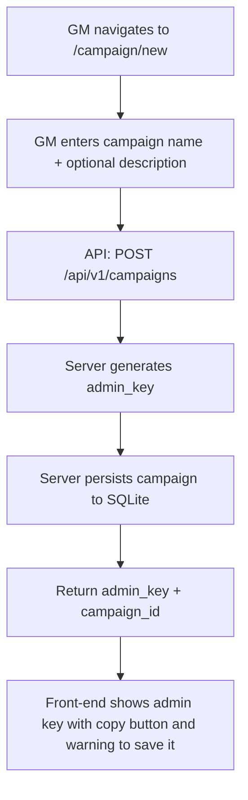
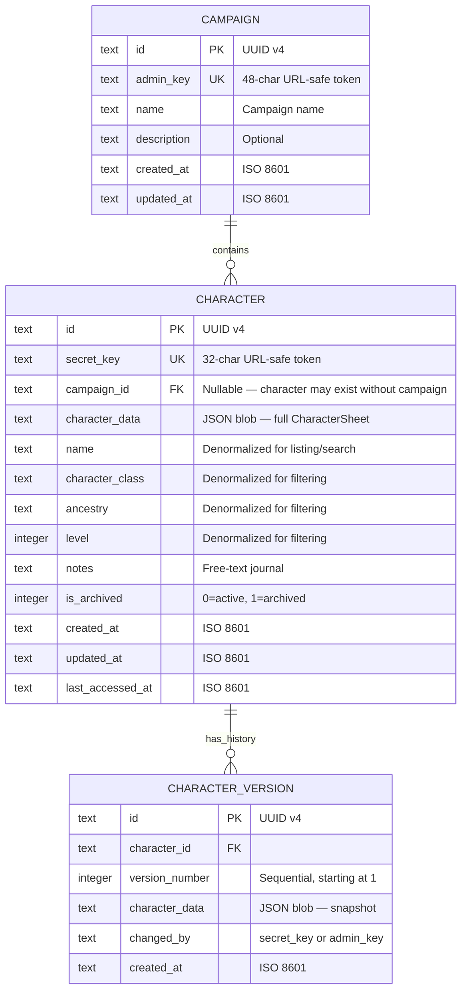
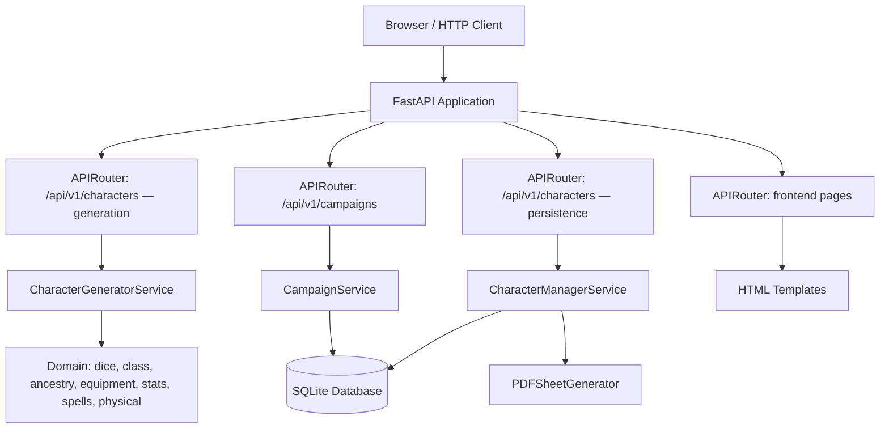
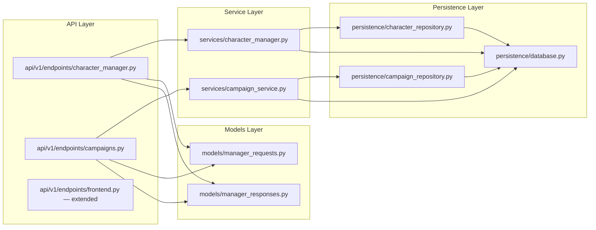
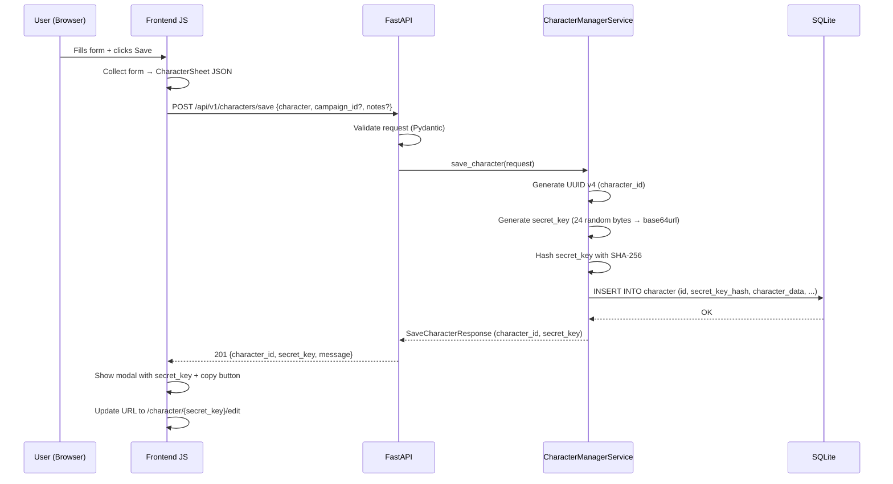
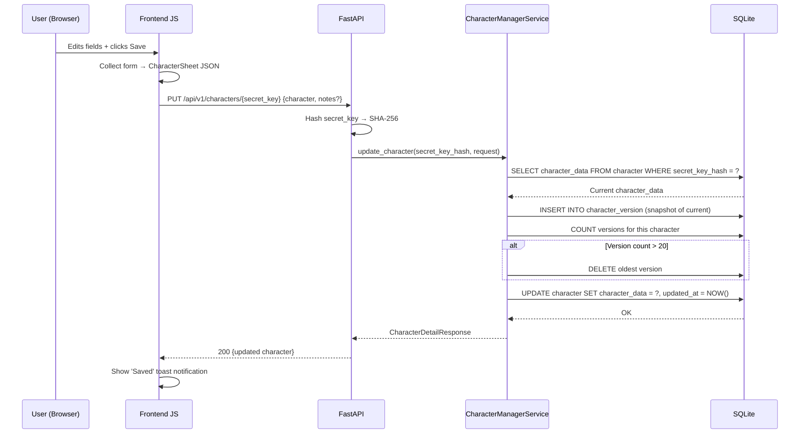
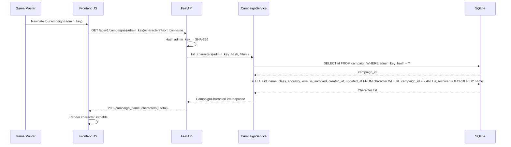
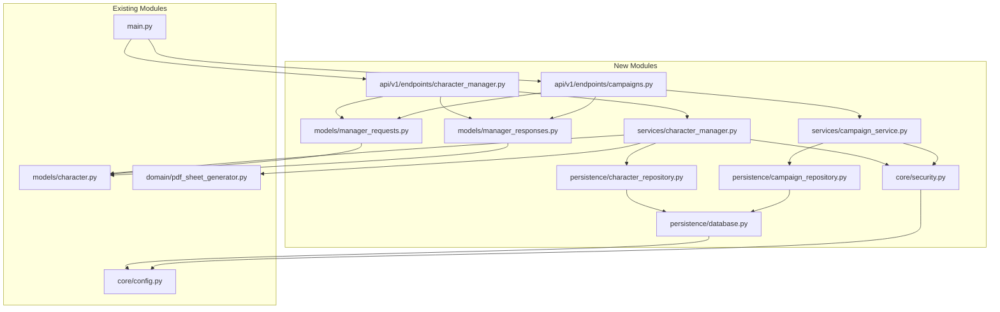

# OSRIC 3.0 Character Generator — Character Sheet Manager Specification

**Version**: 1.0.0
**Date**: 2025-04-26
**Status**: Draft

---

## 1. Executive Summary

Adds a persistent character sheet manager to the existing OSRIC 3.0 Character Generator. Users can create characters by either generating them randomly (existing flow) or manually filling in an HTML character sheet form. Characters are persisted in SQLite with full CRUD operations. Each character receives a unique secret key (no user accounts) for retrieval and editing. A separate admin key grants game masters read-only access to all characters in a campaign. The feature integrates with the existing generation engine and front-end, adding persistence, editing, and campaign management capabilities.

---

## 2. Requirements

### 2.1 Core Requirements

| ID | Requirement | Priority |
|----|-------------|----------|
| CSM-001 | Save a generated character to SQLite, returning a unique secret key | Must |
| CSM-002 | Save a manually-created character (filled HTML form) to SQLite, returning a unique secret key | Must |
| CSM-003 | Retrieve a character by secret key | Must |
| CSM-004 | Update any field on a character sheet via its secret key | Must |
| CSM-005 | Delete a character via its secret key | Must |
| CSM-006 | Generate a unique, cryptographically random secret key per character (URL-safe, 32 chars) | Must |
| CSM-007 | No user accounts — secret key is the sole authentication token for a character | Must |
| CSM-008 | Admin key grants read-only access to all characters within a campaign | Must |
| CSM-009 | Admin key is a separate cryptographically random token (URL-safe, 48 chars) | Must |
| CSM-010 | Characters are grouped by campaign via the admin key | Must |
| CSM-011 | Use SQLite as the persistence backend | Must |
| CSM-012 | HTML form allows full manual entry of all character sheet fields | Must |
| CSM-013 | HTML form pre-populates with generated character data when using "Generate" flow | Must |
| CSM-014 | All fields remain editable after generation or load | Must |

### 2.2 Proposed Improvements

| ID | Requirement | Priority |
|----|-------------|----------|
| CSM-015 | Character name is mandatory before saving | Must |
| CSM-016 | Soft-delete (archive) instead of hard delete; admin can still see archived characters | Should |
| CSM-017 | `created_at` and `updated_at` timestamps on every character | Must |
| CSM-018 | Character version history: store previous versions on each update (max 20 per character) | Should |
| CSM-019 | Export character as PDF via existing PDF generator from the manager view | Must |
| CSM-020 | Export character as JSON download from the manager view | Should |
| CSM-021 | Shareable read-only URL using the secret key (distinct from edit URL) | Should |
| CSM-022 | Rate limiting: max 60 saves per minute per IP, max 10 campaign creations per hour per IP | Should |
| CSM-023 | Admin key rotation: allow generating a new admin key (old key becomes invalid) | Should |
| CSM-024 | Character notes/journal field (free-text, persisted) | Should |
| CSM-025 | OSRIC rules validation on manual entry (warn if ability scores are out of range, class requirements unmet, etc.) — advisory only, not blocking | Should |
| CSM-026 | Campaign metadata: name and optional description attached to admin key | Should |
| CSM-027 | Admin dashboard: list all characters, filter by class/ancestry/level, sort by name/date | Should |
| CSM-028 | Character last-accessed timestamp for stale data cleanup | Should |
| CSM-029 | Character sheet live-calculates and displays encumbrance status and effective movement from equipment weights, STR allowance, ancestry base movement, and armor movement cap | Must |

---

## 3. Workflows

### 3.1 Create Character via Generation

```mermaid
flowchart TD
    A[User clicks 'Generate'] --> B[API: POST /api/v1/characters/generate]
    B --> C[Existing generation engine produces CharacterSheet]
    C --> D[Front-end displays filled form]
    D --> E{User edits fields?}
    E -->|Yes| F[User modifies form fields]
    E -->|No| G[User clicks 'Save']
    F --> G
    G --> H[API: POST /api/v1/characters/save]
    H --> I[Server generates secret_key]
    I --> J[Server persists to SQLite]
    J --> K[Return secret_key + character_id]
    K --> L[Front-end shows secret key with copy button]
    L --> M[Front-end URL updates to /character/{secret_key}/edit]
```

### 3.2 Create Character via Manual Entry

```mermaid
flowchart TD
    A[User navigates to /character/new] --> B[Front-end shows blank character form]
    B --> C[User fills in fields manually]
    C --> D{Validation passes?}
    D -->|No| E[Show validation warnings — advisory only]
    E --> C
    D -->|Yes| F[User clicks 'Save']
    F --> G[API: POST /api/v1/characters/save]
    G --> H[Server generates secret_key]
    H --> I[Server persists to SQLite]
    I --> J[Return secret_key + character_id]
    J --> K[Front-end shows secret key with copy button]
    K --> L[Front-end URL updates to /character/{secret_key}/edit]
```

### 3.3 Retrieve and Edit Character

```mermaid
flowchart TD
    A[User navigates to /character/{secret_key}/edit] --> B[API: GET /api/v1/characters/{secret_key}]
    B --> C{Key valid?}
    C -->|No| D[Return 404]
    C -->|Yes| E[Return CharacterSheet JSON]
    E --> F[Front-end populates form]
    F --> G[User edits fields]
    G --> H[User clicks 'Save']
    H --> I[API: PUT /api/v1/characters/{secret_key}]
    I --> J[Server validates and updates SQLite]
    J --> K[Return updated CharacterSheet]
```

### 3.4 Admin View Campaign

```mermaid
flowchart TD
    A[GM navigates to /campaign/{admin_key}] --> B[API: GET /api/v1/campaigns/{admin_key}/characters]
    B --> C{Admin key valid?}
    C -->|No| D[Return 404]
    C -->|Yes| E[Return list of all characters in campaign]
    E --> F[Front-end renders character list table]
    F --> G{GM clicks a character?}
    G -->|Yes| H[Navigate to /campaign/{admin_key}/character/{character_id}]
    H --> I[API: GET /api/v1/campaigns/{admin_key}/characters/{character_id}]
    I --> J[Front-end displays read-only character sheet]
```

### 3.5 Campaign Creation



---

## 4. Data Models

### 4.1 Database Schema (SQLite)



### 4.2 Pydantic Models

```python
from datetime import datetime
from pydantic import BaseModel, Field
from osric_character_gen.models.character import CharacterSheet


class SaveCharacterRequest(BaseModel):
    character: CharacterSheet
    campaign_id: str | None = Field(
        default=None,
        description="Optional campaign UUID to associate this character with",
    )
    notes: str | None = Field(
        default=None,
        max_length=10000,
        description="Optional character notes/journal",
    )


class SaveCharacterResponse(BaseModel):
    character_id: str
    secret_key: str = Field(
        description="32-char URL-safe token. Store this — it cannot be recovered.",
    )
    message: str = "Character saved. Store your secret key — it cannot be recovered."


class UpdateCharacterRequest(BaseModel):
    character: CharacterSheet
    notes: str | None = Field(
        default=None,
        max_length=10000,
    )


class CharacterSummary(BaseModel):
    character_id: str
    name: str
    character_class: str
    ancestry: str
    level: int
    is_archived: bool
    created_at: datetime
    updated_at: datetime


class CampaignCharacterListResponse(BaseModel):
    campaign_name: str
    campaign_description: str | None
    characters: list[CharacterSummary]
    total: int


class CreateCampaignRequest(BaseModel):
    name: str = Field(min_length=1, max_length=200)
    description: str | None = Field(default=None, max_length=2000)


class CreateCampaignResponse(BaseModel):
    campaign_id: str
    admin_key: str = Field(
        description="48-char URL-safe token. Store this — it cannot be recovered.",
    )
    message: str = "Campaign created. Store your admin key — it cannot be recovered."


class CharacterVersionResponse(BaseModel):
    version_number: int
    character_data: CharacterSheet
    created_at: datetime


class CharacterDetailResponse(BaseModel):
    character_id: str
    character: CharacterSheet
    notes: str | None
    is_archived: bool
    created_at: datetime
    updated_at: datetime
```

---

## 5. API Specification

### 5.1 New Endpoints

| Method | Path | Auth | Description |
|--------|------|------|-------------|
| POST | `/api/v1/characters/save` | None | Save a new character, returns secret_key |
| GET | `/api/v1/characters/{secret_key}` | secret_key in path | Retrieve character by secret key |
| PUT | `/api/v1/characters/{secret_key}` | secret_key in path | Update character |
| DELETE | `/api/v1/characters/{secret_key}` | secret_key in path | Archive (soft-delete) character |
| GET | `/api/v1/characters/{secret_key}/versions` | secret_key in path | List version history |
| GET | `/api/v1/characters/{secret_key}/versions/{version}` | secret_key in path | Retrieve specific version |
| GET | `/api/v1/characters/{secret_key}/pdf` | secret_key in path | Export character as PDF |
| GET | `/api/v1/characters/{secret_key}/json` | secret_key in path | Export character as JSON download |
| POST | `/api/v1/campaigns` | None | Create a new campaign, returns admin_key |
| GET | `/api/v1/campaigns/{admin_key}/characters` | admin_key in path | List all characters in campaign |
| GET | `/api/v1/campaigns/{admin_key}/characters/{character_id}` | admin_key in path | View single character (read-only) |
| PUT | `/api/v1/campaigns/{admin_key}` | admin_key in path | Update campaign metadata |
| POST | `/api/v1/campaigns/{admin_key}/rotate-key` | admin_key in path | Rotate admin key |
| POST | `/api/v1/characters/{secret_key}/campaign/{campaign_id}` | secret_key in path | Join a campaign |
| DELETE | `/api/v1/characters/{secret_key}/campaign` | secret_key in path | Leave a campaign |

### 5.2 Existing Endpoints (unchanged)

| Method | Path | Description |
|--------|------|-------------|
| GET | `/api/v1/characters/generate` | Generate random character (JSON) |
| GET | `/api/v1/characters/generate/pdf` | Generate random character (PDF) |
| GET | `/health` | Health check |

### 5.3 Endpoint Details

#### POST /api/v1/characters/save

**Request Body**: `SaveCharacterRequest`

```json
{
  "character": { /* full CharacterSheet object */ },
  "campaign_id": "optional-uuid",
  "notes": "Optional notes text"
}
```

**Response 201**: `SaveCharacterResponse`

```json
{
  "character_id": "uuid-v4",
  "secret_key": "Abc123...32chars",
  "message": "Character saved. Store your secret key — it cannot be recovered."
}
```

**Response 422**: Validation error (malformed character data).

#### GET /api/v1/characters/{secret_key}

**Path Param**: `secret_key` — 32-char URL-safe token.

**Response 200**: `CharacterDetailResponse`

**Response 404**: `{"detail": "Character not found"}`

Updates `last_accessed_at` on every access.

#### PUT /api/v1/characters/{secret_key}

**Request Body**: `UpdateCharacterRequest`

**Response 200**: `CharacterDetailResponse` (updated)

Before writing the update, the server creates a `CHARACTER_VERSION` row with the previous state. If version count exceeds 20, the oldest version is deleted.

**Response 404**: `{"detail": "Character not found"}`

#### DELETE /api/v1/characters/{secret_key}

Sets `is_archived = 1`. Does not delete data.

**Response 200**: `{"detail": "Character archived"}`

**Response 404**: `{"detail": "Character not found"}`

#### GET /api/v1/campaigns/{admin_key}/characters

**Query Parameters**:

| Param | Type | Default | Description |
|-------|------|---------|-------------|
| `class_filter` | str | None | Filter by class name |
| `ancestry_filter` | str | None | Filter by ancestry |
| `level_min` | int | None | Minimum level |
| `level_max` | int | None | Maximum level |
| `include_archived` | bool | false | Include archived characters |
| `sort_by` | str | "name" | Sort field: name, class, level, updated_at |
| `sort_order` | str | "asc" | Sort direction: asc, desc |

**Response 200**: `CampaignCharacterListResponse`

**Response 404**: `{"detail": "Campaign not found"}`

#### POST /api/v1/campaigns/{admin_key}/rotate-key

**Response 200**:

```json
{
  "new_admin_key": "NewKey...48chars",
  "message": "Admin key rotated. Old key is now invalid."
}
```

#### POST /api/v1/characters/{secret_key}/campaign/{campaign_id}

Associates an existing character with a campaign. A character can belong to at most one campaign.

**Response 200**: `{"detail": "Character joined campaign"}`

**Response 404**: Character or campaign not found.

**Response 409**: Character already in a different campaign.

---

## 6. Architecture

### 6.1 System Architecture (Extended)



### 6.2 New Component Architecture



### 6.3 Project Structure Additions

```
src/osric_character_gen/
├── persistence/             # NEW — database layer
│   ├── __init__.py
│   ├── database.py          # SQLite connection, migrations, table creation
│   ├── character_repository.py  # Character CRUD operations
│   └── campaign_repository.py   # Campaign CRUD operations
├── services/
│   ├── character_generator.py   # EXISTING — unchanged
│   ├── character_manager.py     # NEW — save/load/update/delete/version
│   └── campaign_service.py      # NEW — campaign CRUD, admin key ops
├── models/
│   ├── character.py             # EXISTING — unchanged
│   ├── requests.py              # EXISTING — unchanged
│   ├── responses.py             # EXISTING — unchanged
│   ├── manager_requests.py      # NEW — save/update/campaign requests
│   └── manager_responses.py     # NEW — save/list/detail responses
├── api/v1/endpoints/
│   ├── characters.py            # EXISTING — unchanged
│   ├── character_manager.py     # NEW — persistence endpoints
│   ├── campaigns.py             # NEW — campaign endpoints
│   └── frontend.py              # MODIFIED — add manager pages
└── core/
    ├── config.py                # MODIFIED — add DB path, key lengths
    └── security.py              # NEW — key generation, hashing
```

---

## 7. Security

### 7.1 Key Generation

```python
import secrets

def generate_secret_key() -> str:
    """32-char URL-safe token for character access."""
    return secrets.token_urlsafe(24)  # 24 bytes → 32 base64 chars

def generate_admin_key() -> str:
    """48-char URL-safe token for campaign admin access."""
    return secrets.token_urlsafe(36)  # 36 bytes → 48 base64 chars
```

### 7.2 Key Storage

Keys are stored as **SHA-256 hashes** in the database. The plaintext key is returned to the user exactly once (at creation) and never stored.

Lookup process:
1. Client sends `secret_key` in URL path
2. Server hashes the received key with SHA-256
3. Server queries `WHERE secret_key_hash = ?`

This means:
- Database breach does not expose keys
- Keys cannot be recovered by server operators
- Lost keys are unrecoverable (by design)

### 7.3 Key Format

| Key Type | Raw Bytes | Encoded Length | Character Set |
|----------|-----------|----------------|---------------|
| Secret key | 24 | 32 | `[A-Za-z0-9_-]` |
| Admin key | 36 | 48 | `[A-Za-z0-9_-]` |

### 7.4 Threat Model

| Threat | Mitigation |
|--------|------------|
| Brute-force key guessing | 24 bytes = 192 bits of entropy. Infeasible. |
| Database theft | Keys stored as SHA-256 hashes. Originals not stored. |
| Key leakage via logs | Keys must never appear in server logs. Log only key hashes or character IDs. |
| Enumeration of characters | No list endpoint without a valid key. IDs are UUIDs, not sequential. |
| Admin key compromise | Key rotation endpoint invalidates old key immediately. |
| Injection attacks | Parameterized queries only. Pydantic validates all input. |
| Excessive writes | Rate limiting: 60 saves/min/IP, 10 campaign creations/hour/IP. |

### 7.5 Input Validation

- All character data passes through Pydantic model validation (existing `CharacterSheet`)
- `notes` field: max 10,000 characters, HTML stripped on save
- `campaign.name`: 1–200 characters
- `campaign.description`: max 2,000 characters
- All string fields sanitized against XSS (strip HTML tags)

---

## 8. Database Implementation

### 8.1 SQLite Configuration

```python
DB_PATH = "data/osric_characters.db"

# Connection settings
PRAGMAS = {
    "journal_mode": "wal",       # Write-Ahead Logging for concurrent reads
    "foreign_keys": "on",        # Enforce FK constraints
    "busy_timeout": 5000,        # 5s retry on lock
    "synchronous": "normal",     # Balance safety/performance
}
```

### 8.2 Migration Strategy

Schema versioning via a `schema_version` table. On application startup:

1. Check if database file exists
2. If not, create all tables
3. If yes, check `schema_version` and apply pending migrations
4. Migrations are numbered Python functions in `persistence/migrations/`

### 8.3 Table Creation SQL

```sql
CREATE TABLE IF NOT EXISTS schema_version (
    version INTEGER PRIMARY KEY,
    applied_at TEXT NOT NULL DEFAULT (datetime('now'))
);

CREATE TABLE IF NOT EXISTS campaign (
    id TEXT PRIMARY KEY,
    admin_key_hash TEXT NOT NULL UNIQUE,
    name TEXT NOT NULL,
    description TEXT,
    created_at TEXT NOT NULL DEFAULT (datetime('now')),
    updated_at TEXT NOT NULL DEFAULT (datetime('now'))
);

CREATE TABLE IF NOT EXISTS character (
    id TEXT PRIMARY KEY,
    secret_key_hash TEXT NOT NULL UNIQUE,
    campaign_id TEXT REFERENCES campaign(id) ON DELETE SET NULL,
    character_data TEXT NOT NULL,
    name TEXT NOT NULL,
    character_class TEXT NOT NULL,
    ancestry TEXT NOT NULL,
    level INTEGER NOT NULL DEFAULT 1,
    notes TEXT,
    is_archived INTEGER NOT NULL DEFAULT 0,
    created_at TEXT NOT NULL DEFAULT (datetime('now')),
    updated_at TEXT NOT NULL DEFAULT (datetime('now')),
    last_accessed_at TEXT NOT NULL DEFAULT (datetime('now'))
);

CREATE TABLE IF NOT EXISTS character_version (
    id TEXT PRIMARY KEY,
    character_id TEXT NOT NULL REFERENCES character(id) ON DELETE CASCADE,
    version_number INTEGER NOT NULL,
    character_data TEXT NOT NULL,
    changed_by_hash TEXT NOT NULL,
    created_at TEXT NOT NULL DEFAULT (datetime('now')),
    UNIQUE(character_id, version_number)
);

CREATE INDEX IF NOT EXISTS idx_character_campaign ON character(campaign_id);
CREATE INDEX IF NOT EXISTS idx_character_class ON character(character_class);
CREATE INDEX IF NOT EXISTS idx_character_ancestry ON character(ancestry);
CREATE INDEX IF NOT EXISTS idx_character_level ON character(level);
CREATE INDEX IF NOT EXISTS idx_character_archived ON character(is_archived);
CREATE INDEX IF NOT EXISTS idx_character_version_char ON character_version(character_id);
```

### 8.4 Connection Management

Use a module-level connection pool pattern with FastAPI's lifespan:

```python
from contextlib import asynccontextmanager
import sqlite3

@asynccontextmanager
async def lifespan(app: FastAPI):
    # Startup: initialize database
    init_database()
    yield
    # Shutdown: close connections
    close_database()
```

SQLite operations use synchronous `sqlite3` module wrapped in `asyncio.to_thread()` for non-blocking behavior in async endpoints.

---

## 9. Front-End Pages

### 9.1 New Routes

| URL | Page | Description |
|-----|------|-------------|
| `/` | Home | Existing generator page (unchanged) |
| `/character/new` | New Character | Blank editable form for manual entry |
| `/character/{secret_key}/edit` | Edit Character | Load + edit existing character |
| `/character/{secret_key}/view` | View Character | Read-only shareable view |
| `/campaign/new` | Create Campaign | Form to create a new campaign |
| `/campaign/{admin_key}` | Campaign Dashboard | List of all characters in campaign |
| `/campaign/{admin_key}/character/{character_id}` | Campaign Character View | Read-only view of one character |

### 9.2 HTML Form Fields

The character form mirrors the existing `CharacterSheet` model structure. All fields are editable `<input>` or `<select>` elements:

**Header Section**:
- Character name (text input, required)
- Class (select: 10 classes)
- Level (number input: 1–20)
- Alignment (select: 9 alignments)
- Ancestry (select: 7 ancestries)
- XP (number input)
- XP Bonus % (number input)

**Ability Scores Section**:
- STR, DEX, CON, INT, WIS, CHA (number inputs: 1–25)
- Exceptional STR (number input: 1–100, visible only when STR=18 and class is fighter-type)

**Combat Section**:
- Hit Points (number input)
- AC Descending / Ascending (number inputs)
- THAC0 / BTHB (number inputs)
- Saving Throws: 5 fields (number inputs)

**Equipment Section**:
- Armor (select or text)
- Shield (select or text)
- Weapons (dynamic list: add/remove rows)
- Equipment (dynamic list: add/remove rows)
- Gold / Coin purse (number inputs for each denomination)

**Skills Section** (conditional):
- Thief skills: 8 fields (percentage inputs)
- Turn undead table (conditional on class)
- Spell slots, spells memorized, spellbook (conditional on spellcasting class)

**Physical Section**:
- Height, Weight, Age, Gender

**Features Section**:
- Ancestry features (text list)
- Class features (text list)
- Weapon proficiencies (text list)
- Languages (text list)
- Notes (textarea, max 10,000 chars)

### 9.3 Form Behavior

```mermaid
flowchart TD
    A[Page Load] --> B{URL has secret_key?}
    B -->|Yes| C[Fetch character from API]
    B -->|No| D[Show blank form]
    C --> E[Populate all form fields]
    D --> E2[Enable 'Generate Random' button]
    E --> F[All fields editable]
    E2 --> F
    F --> G{User clicks 'Recalculate Derived Stats'?}
    G -->|Yes| H[Client-side: recalculate bonuses, saves, AC from ability scores + class + level]
    G -->|No| I{User clicks 'Save'?}
    H --> F
    I -->|Yes| J[Collect all form fields into CharacterSheet JSON]
    J --> K{Has secret_key?}
    K -->|Yes| L[PUT /api/v1/characters/{secret_key}]
    K -->|No| M[POST /api/v1/characters/save]
    L --> N[Show 'Saved' confirmation]
    M --> O[Show secret_key modal — user must copy]
    O --> P[Update URL to /character/{secret_key}/edit]
```

### 9.4 Live Encumbrance & Movement Calculator

The character sheet must calculate and display encumbrance status and effective movement in real time as the user edits equipment, ability scores, ancestry, or armor. This mirrors the server-side logic in `stats_calculator.calculate_encumbrance()` but runs entirely client-side in JavaScript.

#### 9.4.1 Display Panel

A dedicated "Encumbrance & Movement" panel is always visible on the character sheet. It contains:

| Field | Value | Style |
|-------|-------|-------|
| Total Weight | Sum of all equipped item weights (lbs) | Numeric, auto-calculated |
| STR Encumbrance Allowance | From STR table (0–300 lbs) | Numeric, auto-calculated from STR score |
| Overage | `max(0, total_weight - str_allowance)` | Numeric, auto-calculated |
| Encumbrance Status | Unencumbered / Light / Moderate / Heavy / Immobile | Color-coded badge |
| Base Movement | From ancestry (90 or 120 ft) | Numeric, auto-set from ancestry select |
| Armor Movement Cap | From equipped armor type (60/90/120/999) | Numeric, auto-set from armor select |
| Effective Movement | `min(base_movement × multiplier, armor_cap)` | Numeric, auto-calculated |
| Movement Bar | Visual progress bar showing effective vs base | Green/yellow/orange/red |

#### 9.4.2 Encumbrance Tiers (Client-Side Logic)

Duplicate the server-side thresholds exactly:

```javascript
function calculateEncumbrance(totalWeight, strAllowance, baseMovement, armorCap) {
    const overage = totalWeight - strAllowance;
    let status, multiplier;

    if (overage <= 0) {
        status = "Unencumbered";
        multiplier = 1.0;
    } else if (overage <= 40) {
        status = "Light";
        multiplier = 0.75;
    } else if (overage <= 80) {
        status = "Moderate";
        multiplier = 0.5;
    } else if (overage <= 120) {
        status = "Heavy";
        multiplier = 0.25;
    } else {
        status = "Immobile";
        multiplier = 0.0;
    }

    const encMovement = Math.floor(baseMovement * multiplier);
    const effectiveMovement = Math.min(encMovement, armorCap);
    return { status, effectiveMovement, overage: Math.max(0, overage) };
}
```

#### 9.4.3 STR Encumbrance Allowance Table (Client-Side)

Embed the full STR-to-allowance lookup in JavaScript:

| STR | Allowance (lbs) |
|-----|----------------|
| 3 | 0 |
| 4–5 | 10 |
| 6–7 | 20 |
| 8–11 | 35 |
| 12–13 | 45 |
| 14–15 | 55 |
| 16 | 70 |
| 17 | 85 |
| 18 | 110 |
| 18.01–50 | 135 |
| 18.51–75 | 160 |
| 18.76–90 | 185 |
| 18.91–99 | 235 |
| 18.00 (100) | 300 |

For exceptional strength (STR 18 + percentile), the lookup uses the `exceptional_strength` field when the class is Fighter, Paladin, or Ranger.

#### 9.4.4 Armor Movement Cap Lookup (Client-Side)

| Armor | Movement Cap |
|-------|--------------|
| None (unarmored) | 120 |
| Leather | 120 |
| Padded | 90 |
| Studded Leather | 90 |
| Ring Mail | 90 |
| Scale/Lamellar | 60 |
| Chain Mail | 90 |
| Splint | 60 |
| Banded | 90 |
| Plate Mail | 60 |
| Magic armor (any) | mundane cap + 30 |

#### 9.4.5 Ancestry Base Movement Lookup (Client-Side)

| Ancestry | Base Movement |
|----------|---------------|
| Dwarf | 90 ft |
| Elf | 120 ft |
| Gnome | 90 ft |
| Half-Elf | 120 ft |
| Half-Orc | 120 ft |
| Halfling | 90 ft |
| Human | 120 ft |

Monk override: If class is Monk, base movement comes from the Monk Movement table (150 ft at level 1, increasing per level up to 290 ft at level 17).

#### 9.4.6 Recalculation Triggers

The encumbrance panel recalculates on any of these events:

| Event | Fields Affected |
|-------|-----------------|
| Equipment row added/removed | Total weight |
| Weapon row added/removed | Total weight |
| Armor selection changed | Total weight, armor movement cap |
| Shield selection changed | Total weight |
| STR score changed | STR allowance |
| Exceptional STR changed | STR allowance (fighter types only) |
| Ancestry changed | Base movement |
| Class changed | Base movement (Monk override), STR allowance (exceptional STR eligibility) |
| Level changed | Base movement (Monk only) |
| Item weight manually edited | Total weight |

Recalculation is synchronous and immediate (no debounce needed — the computation is trivial).

#### 9.4.7 Visual Indicators

| Status | Badge Color | Movement Bar Color | Icon |
|--------|-------------|-------------------|------|
| Unencumbered | Green (#2d5a1e) | Green | — |
| Light | Yellow (#8b7b00) | Yellow | ⚠ |
| Moderate | Orange (#b85c00) | Orange | ⚠ |
| Heavy | Red (#8b1a1a) | Red | ⛔ |
| Immobile | Dark red (#5a0000) | Dark red, pulsing | ⛔ |

When status is Heavy or Immobile, the panel border changes to red and an inline warning is displayed:
- **Heavy**: "Movement severely reduced. Consider dropping equipment."
- **Immobile**: "Cannot move! Total weight exceeds carrying capacity by {overage - 120} lbs."

#### 9.4.8 Coin Weight

OSRIC rule: 10 coins = 1 pound. The encumbrance calculator must include carried coin weight:

```
coin_weight_lbs = (platinum + gold + electrum + silver + copper) / 10
```

Coin weight is added to total carried weight. When coin denomination fields change, encumbrance recalculates.

#### 9.4.9 Persistence

The calculated encumbrance fields (`total_weight_lbs`, `encumbrance_allowance`, `encumbrance_status`, `base_movement`, `effective_movement`) are included in the `CharacterSheet` JSON saved to the database. On load, the client recalculates from the raw data (equipment weights, STR, ancestry) rather than trusting the stored values — the stored values serve as a server-side cache for API consumers that don't recalculate.

### 9.5 OSRIC Validation (Advisory)

Client-side validation runs on blur/change and displays warnings (yellow), not errors (red). Saving is not blocked.

| Check | Warning Message |
|-------|-----------------|
| Ability score outside 3–19 range | "Ability scores are typically 3–19 in OSRIC" |
| Class minimum requirements unmet | "This class requires minimum STR 9" (example) |
| Ancestry/class incompatible | "Dwarves cannot be Magic-Users in OSRIC" |
| HP exceeds expected maximum | "HP seems high for a level X {class}" |
| Alignment restricted for class | "Paladins must be Lawful Good in OSRIC" |
| Encumbrance status is Heavy or Immobile | "Character is heavily encumbered — movement severely reduced" |

---

## 10. Configuration

### 10.1 New Configuration Parameters

Add to `core/config.py`:

```python
from pydantic_settings import BaseSettings


class Settings(BaseSettings):
    # Database
    db_path: str = "data/osric_characters.db"
    
    # Key lengths (bytes, not encoded length)
    secret_key_bytes: int = 24   # → 32 URL-safe chars
    admin_key_bytes: int = 36    # → 48 URL-safe chars
    
    # Version history
    max_versions_per_character: int = 20
    
    # Rate limiting
    save_rate_limit: int = 60          # per minute per IP
    campaign_create_rate_limit: int = 10  # per hour per IP
    
    # Cleanup
    archive_after_days: int = 365      # auto-archive after N days no access
    
    class Config:
        env_prefix = "OSRIC_"
```

### 10.2 New Dependencies

Add to `pyproject.toml`:

```toml
dependencies = [
    # ... existing ...
    "pydantic-settings>=2.7.0",    # For Settings class
    "aiosqlite>=0.21.0",           # Async SQLite (optional, alternative to to_thread)
]
```

---

## 11. Error Handling

| Scenario | HTTP Status | Response |
|----------|-------------|----------|
| Character not found (invalid secret_key) | 404 | `{"detail": "Character not found"}` |
| Campaign not found (invalid admin_key) | 404 | `{"detail": "Campaign not found"}` |
| Validation error (malformed request) | 422 | Pydantic validation detail |
| Character already in campaign | 409 | `{"detail": "Character already belongs to a campaign"}` |
| Rate limit exceeded | 429 | `{"detail": "Rate limit exceeded. Try again later."}` |
| Database error | 500 | `{"detail": "Internal server error"}` |
| Archived character access | 404 | `{"detail": "Character not found"}` (same as invalid key) |

---

## 12. Sequence Diagrams

### 12.1 Save New Character



### 12.2 Update Character



### 12.3 Admin View Campaign



---

## 13. Testing Strategy

### 13.1 New Test Files

```
tests/
├── test_persistence/
│   ├── __init__.py
│   ├── test_database.py            # DB init, migrations, connection
│   ├── test_character_repository.py # CRUD operations
│   └── test_campaign_repository.py  # Campaign CRUD
├── test_services/
│   ├── test_character_manager.py    # Save/load/update/delete/version logic
│   └── test_campaign_service.py     # Campaign management logic
├── test_api/
│   ├── test_character_manager_endpoint.py  # HTTP-level persistence tests
│   └── test_campaign_endpoint.py           # HTTP-level campaign tests
└── test_security/
    ├── __init__.py
    └── test_key_generation.py       # Key generation, hashing, collision resistance
```

### 13.2 Test Categories

| Category | Count (est.) | Description |
|----------|-------------|-------------|
| Key generation | 8 | Uniqueness, length, character set, hashing |
| Character CRUD | 15 | Save, load, update, delete, archive, version history |
| Campaign CRUD | 10 | Create, list, filter, sort, rotate key |
| Campaign membership | 8 | Join, leave, conflict handling |
| API integration | 20 | Full HTTP round-trips for all endpoints |
| Validation | 10 | Invalid keys, malformed data, boundary values |
| Error handling | 8 | 404s, 409s, 422s, 500s |
| Rate limiting | 5 | Threshold enforcement |
| Front-end routes | 6 | Page rendering, form submission |
| **Total** | **~90** | |

### 13.3 Test Fixtures

```python
@pytest.fixture
def test_db(tmp_path):
    """Temporary SQLite database for testing."""
    db_path = tmp_path / "test.db"
    init_database(str(db_path))
    yield str(db_path)


@pytest.fixture
def character_manager(test_db):
    """CharacterManagerService wired to test DB."""
    return CharacterManagerService(db_path=test_db)


@pytest.fixture
def campaign_service(test_db):
    """CampaignService wired to test DB."""
    return CampaignService(db_path=test_db)


@pytest.fixture
def sample_character_sheet():
    """Minimal valid CharacterSheet for testing."""
    # ... returns a CharacterSheet instance with all required fields
```

---

## 14. Dependency Graph



---

## 15. Implementation Phases

### Phase 1: Foundation (Must)
1. `core/security.py` — Key generation + SHA-256 hashing
2. `core/config.py` — Extend with DB and key settings
3. `persistence/database.py` — SQLite init, migrations, connection management
4. `persistence/character_repository.py` — Character CRUD
5. `persistence/campaign_repository.py` — Campaign CRUD
6. `models/manager_requests.py` + `models/manager_responses.py`
7. `services/character_manager.py` — Save, load, update, archive
8. `services/campaign_service.py` — Create, list, rotate key
9. `api/v1/endpoints/character_manager.py` — All character persistence endpoints
10. `api/v1/endpoints/campaigns.py` — All campaign endpoints
11. Update `main.py` to register new routers and lifespan

### Phase 2: Front-End Integration (Must)
12. Extend `frontend.py` with editable form pages
13. Add save/load/update JavaScript logic
14. Add campaign dashboard page
15. Add secret key modal and copy functionality

### Phase 3: Enhancements (Should)
16. Version history endpoints and UI
17. Rate limiting middleware
18. Admin key rotation
19. Advisory OSRIC validation in front-end
20. PDF/JSON export from manager view
21. Campaign join/leave functionality

---

## 16. Operational Concerns

### 16.1 Database Location

Default: `data/osric_characters.db` relative to working directory. Configurable via `OSRIC_DB_PATH` environment variable.

For Docker: mount as a volume:
```yaml
volumes:
  - osric_data:/app/data
```

### 16.2 Backup

SQLite WAL mode allows safe file-level copies while the application is running. Backup strategy: periodic `cp` of the `.db`, `.db-wal`, and `.db-shm` files.

### 16.3 Data Retention

- Active characters: retained indefinitely
- Archived characters: retained for `archive_after_days` (default 365) after last access, then eligible for cleanup
- Character versions: max 20 per character, oldest pruned on update

### 16.4 Monitoring

- Log all save/update/delete operations with character_id (not secret_key)
- Track database file size
- Health check endpoint extended: `{"status": "healthy", "db_size_mb": 1.2, "character_count": 42}`

---

## 17. Assumptions

| # | Assumption |
|---|------------|
| A1 | Secret keys are the sole access mechanism. Lost key = lost character. No recovery flow. |
| A2 | A character belongs to at most one campaign at a time. |
| A3 | The admin key grants read-only access. GMs cannot edit player characters. |
| A4 | Character data is stored as a JSON blob (serialized `CharacterSheet`). Denormalized columns exist only for filtering/sorting. |
| A5 | SQLite is sufficient for the expected load (single-server, low-to-moderate concurrency). Migration to PostgreSQL is a future concern. |
| A6 | Version history stores full snapshots, not diffs. Storage is cheap; simplicity is valued. |
| A7 | Rate limiting is IP-based using in-memory counters. No Redis or external store required. |
| A8 | HTML front-end is a single-page application served from FastAPI. No JavaScript framework (React, Vue, etc.) — vanilla JS only, consistent with existing implementation. |
| A9 | All timestamps are UTC in ISO 8601 format. |
| A10 | The existing `CharacterSheet` Pydantic model is the canonical data format. Manual entry produces the same model as random generation. |

---

## 18. Known Limitations

| # | Limitation |
|---|------------|
| L1 | No real-time collaboration. Two users editing the same character simultaneously will result in last-write-wins. |
| L2 | No key recovery mechanism. This is by design (no email, no accounts). |
| L3 | SQLite limits concurrent writes. Under heavy write load (>100 saves/second), consider PostgreSQL migration. |
| L4 | No image/portrait upload for characters. Text-only character sheets. |
| L5 | Campaign admin key is a single point of control. If the GM loses it and has not rotated, the campaign is orphaned (characters remain accessible via individual keys). |

---

## 19. Future Considerations

| # | Feature | Rationale |
|---|---------|-----------|
| F1 | PostgreSQL migration | If concurrent writes exceed SQLite capacity |
| F2 | WebSocket for real-time updates | Multiple players viewing the same campaign dashboard |
| F3 | Character import from JSON | Allow users to upload a JSON file to populate the form |
| F4 | Bulk generation | GM generates N characters at once for a campaign |
| F5 | Optional email association | Opt-in key recovery via email (no full account system) |
| F6 | Character template library | Pre-built characters that can be cloned |
